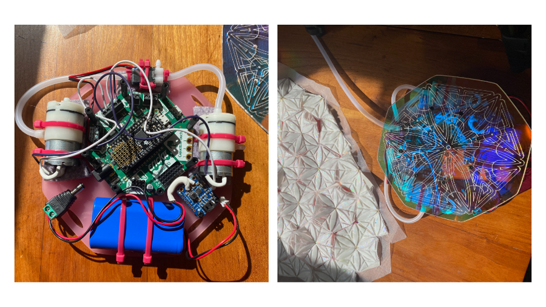
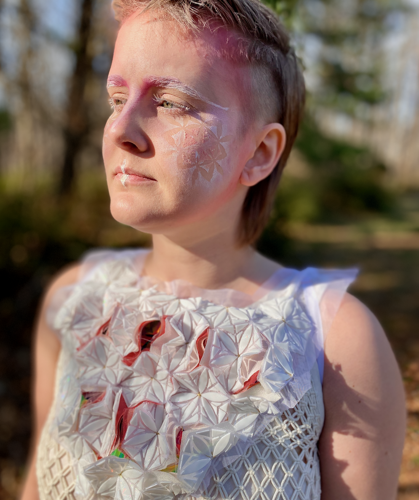
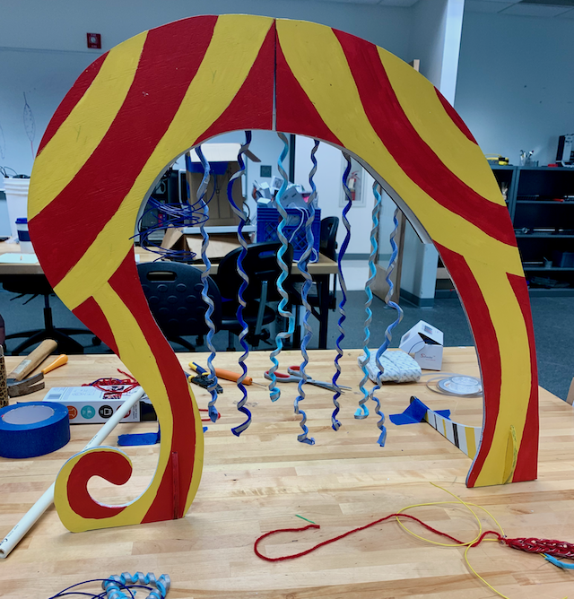
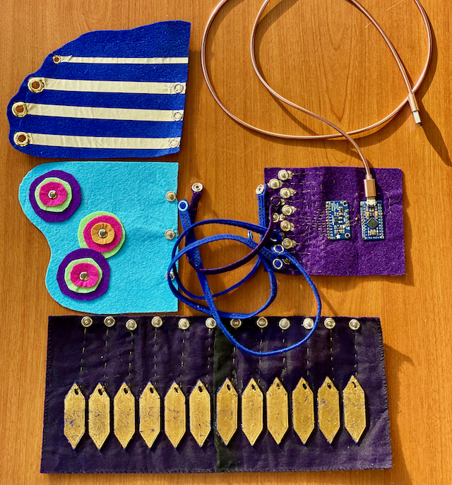

---
hide:
  - navigation
---

# Welcome

Welcome to my documentation website for my journey through the Master in Design for Emergent Futures program. I started this journey in October 2022. I was thrilled to move to Barcelona to create alongside 25 other amazing people. ~~You can see the documentation websites for the rest of my co-hort on the [MDEF 2022-2023 Website](https://fablabbcn.github.io/mdef-docs/academic_year_2022_23/students_websites/).~~ 

## Master in Design for Emergent Futures

 More about the program can be found on the [Master in Design for Emergent Futures site](https://fablabbcn.org/education/master/master-in-design-for-emergent-futures).

## About me

Hello, I'm Amanda Jarvis. I am an interdisciplinary designer and maker based in the Washington, DC area. My work and interests are focused on costume design, wearables, assistive technology, sustainable fashion, interaction design and makerspace education.
 
I approach the act of making as a way to interface with the world and connect with others.

## My background

I grew up on a farm in the High Plains of western Oklahoma. My grandma started teaching me to sew my own clothes at the age of 9. Having the skills to make my own clothes empowered me to make things way beyond what I could buy in stores. Since then I have been a lifelong collector of hobbies. 
 
I took a more non-traditional path with my education studying Fashion Marketing, Business, Costume Design/Theater, and Sculpture. I received an interdisciplinary studies degree in Design for Emerging Technology in the Arts in 2020. In my professional life I have worn many hats including starting a handmade jewelry business, costume design, and managing a university makerspace. 

## Previous work

Much of my recent creative work revolves around prototyping and samples. My creative process is very iterative and always starts with a lot of learning and research. Many of the things I make are very interconnected and the projects build outward upon themselves in all directions. 

### Seasonal Culture
As my final project for the global [Fabricademy Course](https://textile-academy.org/about/) I explored an adjacent future in which poets and artists have an important role in helping society collectively mourn and move forward from the monumental losses caused by climate change and ecological damage. The project consisted of the creation of stories, 3D printed textile samples, electronics prototypes, and multiple collaborations with other artists and creators. You can read more about the project on my [Fabricademy documentation website.](https://class.textile-academy.org/2022/amanda-jarvis/projects/final-project/)

<iframe src="https://player.vimeo.com/video/696352610?h=00319e7aab&amp;badge=0&amp;autopause=0&amp;player_id=0&amp;app_id=58479" frameborder="0" allow="autoplay; fullscreen; picture-in-picture" allowfullscreen style="position:absolute;top:0;left:0;width:100%;height:100%;" title="Draft4"></iframe>

### Motion MIDI
Motion MIDI is an interactive wearable device that transforms data from an accelerometer into music. The MIDI notes are wirelessly transmitted via Bluetooth to any computer or mobile device permitting use of many audio software applications. This device was co-designed with artists, performers, and a software engineer for an ongoing Open Source Interfaces project with the purpose of creating tools for artists and designers to explore alternative ways of interfacing with a computer. Find code for Motion Midi on [GitHub](https://github.com/jarvisb1/ble_midi_9dof)

##### Aerial Performance with Motion Midi (2020)
Motion Midi was used as a wearable musical interface to transform movement into sound. This is part of a collaborative project to explore how wearables can be implemented as a tool for performance research.

<iframe src="https://player.vimeo.com/video/445331719?h=25338609fb" width="640" height="360" frameborder="0" allow="autoplay; fullscreen; picture-in-picture" allowfullscreen></iframe>

<a href="https://vimeo.com/445331719">Aerial Midi Music Performance</a> from <a href="https://vimeo.com/buffalobranded">Buffalo Branded</a> on <a href="https://vimeo.com">Vimeo</a>.

##### Motion Midi Prototypes (2019)
Motion MIDI devices developed in collaboration with GMU Media Arts faculty to be used as an interface with Max MSP for student projects. 

<iframe src="https://player.vimeo.com/video/383836547?h=5ba729dffd" width="640" height="1138" frameborder="0" allow="autoplay; fullscreen; picture-in-picture" allowfullscreen></iframe>

<a href="https://vimeo.com/383836547">Motion MIDI Prototypes</a> from <a href="https://vimeo.com/user107341955">Amanda Jarvis</a> on <a href="https://vimeo.com">Vimeo</a>.

### Other MIDI Projects

#### Rag Harp
Made from upcycled t-shirts, conductive fibers, running on Adafruit Feather Bluetooth. A work in progress made in collaboration with several amazing people and has gone through many iterations including a miniature prototype. Find code on [GitHub](https://github.com/jarvisb1/rag_harp) to build your very own RagHarp. Turn some rags into a musical instrument. ;-) 

<iframe src="https://player.vimeo.com/video/613841587?h=87a7e3fbeb" width="640" height="360" frameborder="0" allow="autoplay; fullscreen; picture-in-picture" allowfullscreen></iframe>

<a href="https://vimeo.com/613841587">Rag Harp in Park</a> from <a href="https://vimeo.com/user107341955">Amanda Jarvis</a> on <a href="https://vimeo.com">Vimeo</a>.

#### Soft Keyboard (2019)
Capacitive touch keyboard made with snapable components developed at a teaching tool for soft circuits workshops. Made from 3D printed components, gold leaf, conductive materials, and felt. 

