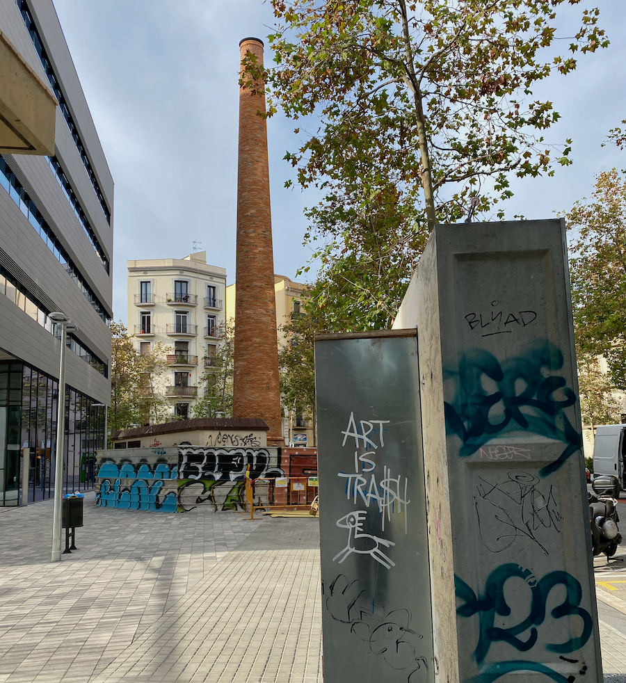

---
hide:
#  - navigation
  - toc
---
# Reflections

This section contains documentation for my first three terms in the Master in Design for Emergent Futures Program. The documentation here captures ideas, thoughts, prototypes and everything else created as I go through the course. 

## Projects that inspire me

- [The Embroidered Computer](https://www.stitchingworlds.net/speculation/the-embroidered-computer/)
- [Fashion Revolution](https://www.fashionrevolution.org/)
- [Anti-Fashion manifesto](https://designmanifestos.files.wordpress.com/2020/04/anti_fashion_manifesto011.pdf)
- [The Critical Makers Reader](https://networkcultures.org/wp-content/uploads/2019/11/CriticalMakersReader.pdf)
- Book - [Manus x Machina: Fashion in an Age of Technology](https://www.goodreads.com/en/book/show/27248507-manus-x-machina)
- Exhibition - [Manus x Machina: Fashion in an Age of Technology](https://www.metmuseum.org/exhibitions/listings/2016/manus-x-machina) 

