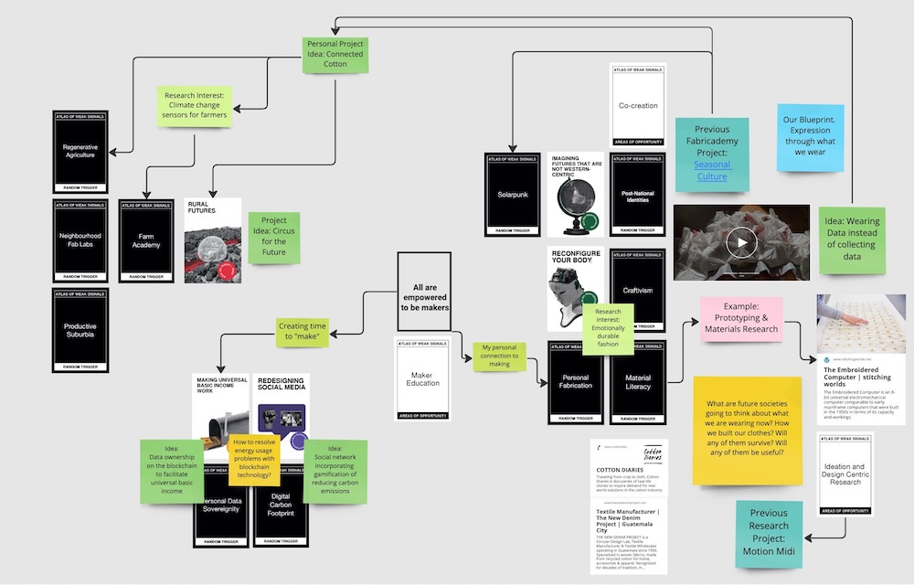
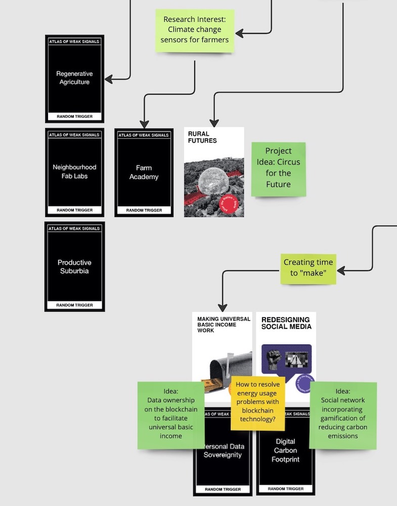

## Weak Signals in the Wild

This week we were introduced to the Atlas of Weak Signals. 

## Design Space v0.9

## Design Space Brief

I found so many of the weak signals interesting and it took me some time to narrow it down. I was able to narrow it down to five weak signals that were the most interesting to me. I then started adding some of the other cards that were related to my research interests, past projects, and future project ideas. At this point I was able to start grouping the weak signals in clusters with some of the other cards. From this I have an idea of which weak signals I want to start with and which ones I'll set aside and reconnect to when the time it right. The five Weak signals I started with were: 

- Reconfigure Your Body
- Imagining Futures That Are Not Western-Centric
- Rural Futures
- Making Universal Basic Income Work
- Redesigning Social Media

All of these do connect to my fight in different ways. My vision for the future is a world where everyone is empowered to be makers. Ultimately I am hoping to take my reflections and explorations from this course and pull everything I learned back into Maker Education. This is why I put this "area of opportunity" card so close and central to my fight. For now I am going to look at the first two weak signals on the list. 

### Reconfigure Your Body

I chose this weak signal because it is closet to my most recent projects with wearable technology and it is something I have spent a lot of time thinking about. This connects most closely to my personal connection to making. I have a background making clothing and costumes since I was about 9 years old. Later when I studied costume design I started to think of everything we wear as a costume and a means of communicating things to others. When we learn about "costume" in the historical context it is referring to what people were wearing in a certain time and the cultural norms of dress. In the past people were communicating the highest forms craft, wealth and power of their age in their cultural dress. I like to think the significance of the current moment, where we are adding the most dense technology to the body that humans have ever created, will not go unnoticed by future costume historians. What will they think of what we are wearing now? I am interested in the spaces where craft bumps up against technology. Where does technology replace craft? Can technology become craft? This is a space where I have already been forming research questions for some time and really would like to continue exploring.

### Imagining Futures that are not Western-Centric

This is something that I have more recently begun exploring and thinking about. When thinking about my own experience with learning about costume history (or any history) I realize that there is so much left out of the story. The things that are left behind are  the smallest representation of the people who lived at any given time. Those (institutions) with the most wealth and power decide what is culturally significant enough to be preserved and studied. Additionally entire cultures were wiped out and archived in the basements of museums held by the very powers that destroyed them. Earlier this year I worked on my [Fabricademy final project](https://class.textile-academy.org/2022/amanda-jarvis/projects/final-project/) where I explored a fictional, solarpunk future where important cultural information is passed through oral tradition in the form of poetry and dress. Going forward I would like to continue explore ideas on what is preserved, what gets re-told, and alternative methodologies to western academic forms of transmission.  

