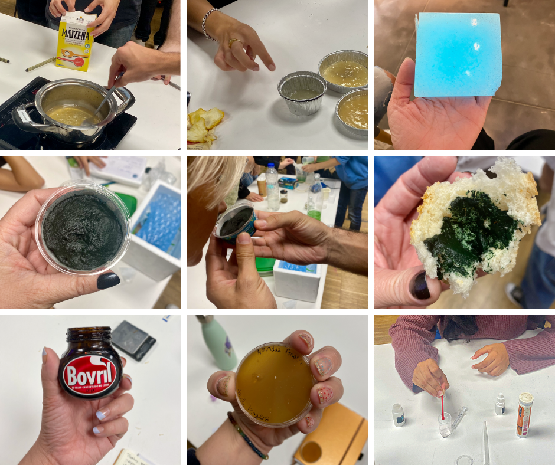
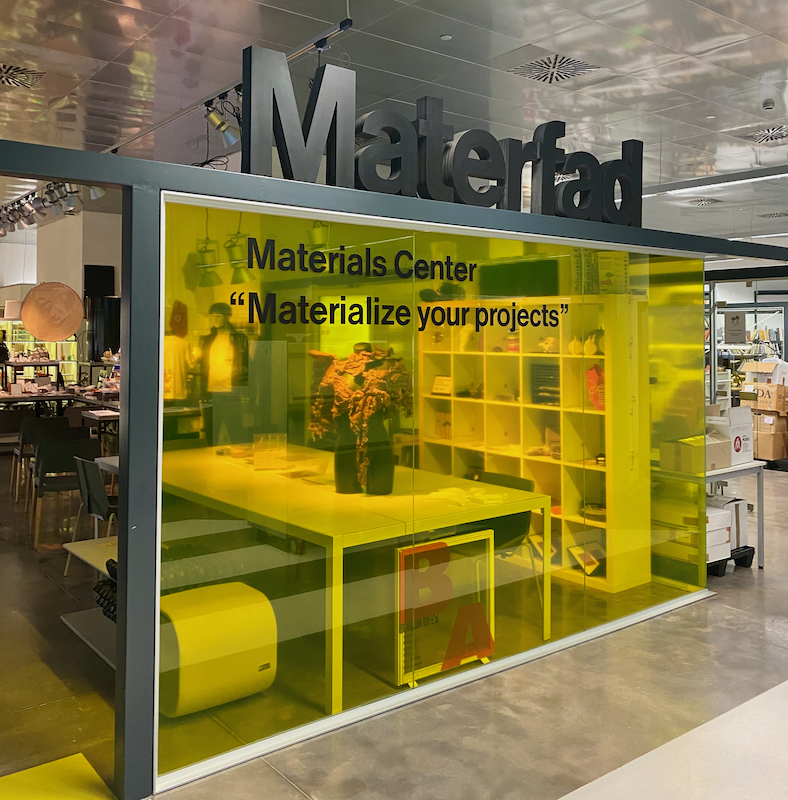
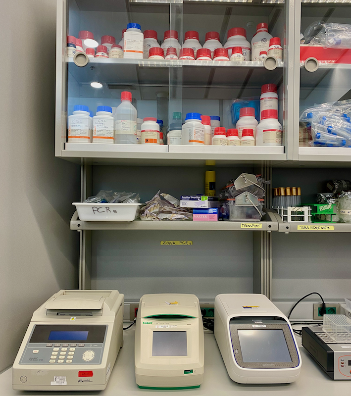

# Biology and Agri Zero

In the rural schools of the small towns I grew up in the high school and elementary students were combined in one building. When I was in first grade some high schoolers came into our classroom to teach us a little about biology and to do an experiment with us. They brought us little round dishes of jelly for us to rub our hands in order to grow the "germs" on our hands. After a few days the dishes of jelly started to grow and turned all sorts of amazing colors. I was absolutely blown away by the "magic". They showed us that we have microorganisms living on our hands and body. The exercise that was definitely meant to teach us about hand washing taught me about the universes we have living around and on us and probably actually resulted in my first grade self not wanting to wash her hands for a while. 

About a year later my mother married my stepfather and we moved to their farm. I spent the rest of my childhood getting my hands dirty while helping the family raise cattle and grow wheat and sorghum. This sort of labor is hard work and I never dreamed of doing it for the rest of my life. I was essentially counting down the days until I graduated high school and could move as far away from farming life as possible. When I got older and moved to a city outside DC I met lots of friends who had spent most of their lives in the suburbs or urban life and they shared with me their dreams of growing their own food. At first I  found this to be pretty amusing then I realized that there is something very inhumane about being disconnected from our food. I think we want to be connected.... and the more connected we are the better it is for us and everything around us. 

This week I got to explore the micro and macro. The microscopic world around us offers so many possibilities for taking care of ourselves and the environment around us. I have been thinking about the big systems and technologies we use to produce our food. We were asked to select a couple photos from the week as a reflection. I made a collage of some of the hands and my classmates and myself getting our hands dirty over the last two weeks. 

## Bio Lab Notes

On the first day we learned about DIY Biology and Biohacking. I learned that a lot of expensive lab equipment can be recreated for a fraction of the cost in a DIY lab or makerspace. Our instructor for the week, Nuria Conde, also showed us some possibilities for portable DIY bio-lab equipment that can be taken into the field for forest. We were given recipes got to prepare different growing mediums(??) for yeast and bacteria. My group received the following recipe to prepare petri dishes to grow yeast. 

> **DIY Yeast Medium** for 1000ml
> 
> 10 grams Bovril
> 20 grams Amino Acids to build up muscle
> 5 grams sugar
> 20 grams agar 

During the next week we got to visit a couple places including the Complex Systems Laboratory at Universitat Pompeu Fabra (UPF) in the PRBB where Nuria works and Materfad materials library. In addition to all of this we also received instruction on how to make bioplastics, kombucha and spirulina. 

## Agri Zero

We also got to hear some lectures on sustainable agriculture of the future from our other instructor, Jonathan Minchin, and about his work on Open Source Beehives (OSBH) and Robotics for Microfarms (ROMI). 

In the past 9 years I have really gotten into permaculture and home-scale organic farming. I have always wondered how practices like this could be scaled up to the sort of farming my parents practice. I asked Jonathan about this and mentioned that right now there aren't great ways to scale permaculture up for large grain crops. After some discussion with him he mentioned that we need to be adding complexity. I am now wondering if I have been asking the wrong questions about scale. In our culture we always want to know how to scale — grow — profit. So it comes natural for me to ask questions like this. How do we scale it up? But maybe we shouldn’t be scaling as all. The focus should be on adding or embracing complexity and diversity.

Beekeeping is also something I have been interested in trying since I got into permaculture but never had the opportunity to do. As part of my permacultural explorations in past years I came across some possible complications of keeping honeybees as they might potentially threaten native bee populations. This week I found a recent article in Scientific American on ["The Problem with Honey Bees".]([https://www.scientificamerican.com/article/the-problem-with-honey-bees/]) In this article author Alison McAfee, a post-doctoral fellow in the Department of Entomology and Plant Pathology, at North Carolina State University, suggests that introduction of honeybee hives in an ecosystem reduces the amount of forage left available for native solitary bee populations and other pollinators. This could have an overall negative impact of biodiversity in the ecosystem. McAffee also mentioned that measuring the interactions of honeybees in a new ecosystem is a tricky thing to research as many parts of the world have already had honeybees introduced by human intervention. To explore this further I consulted an article published in 2019 in Nature titled ["Honeybees disrupt the structure and functionality of plant-pollinator networks".](https://www.nature.com/articles/s41598-019-41271-5#Sec3) where researchers introduced honeybees () intoI also wanted to look at an article published more recently and found one on "Density of invasive western honey bee (Apis mellifera) colonies in fragmented woodlands indicates potential for large impacts on native species" published earlier this year in Nature. 

