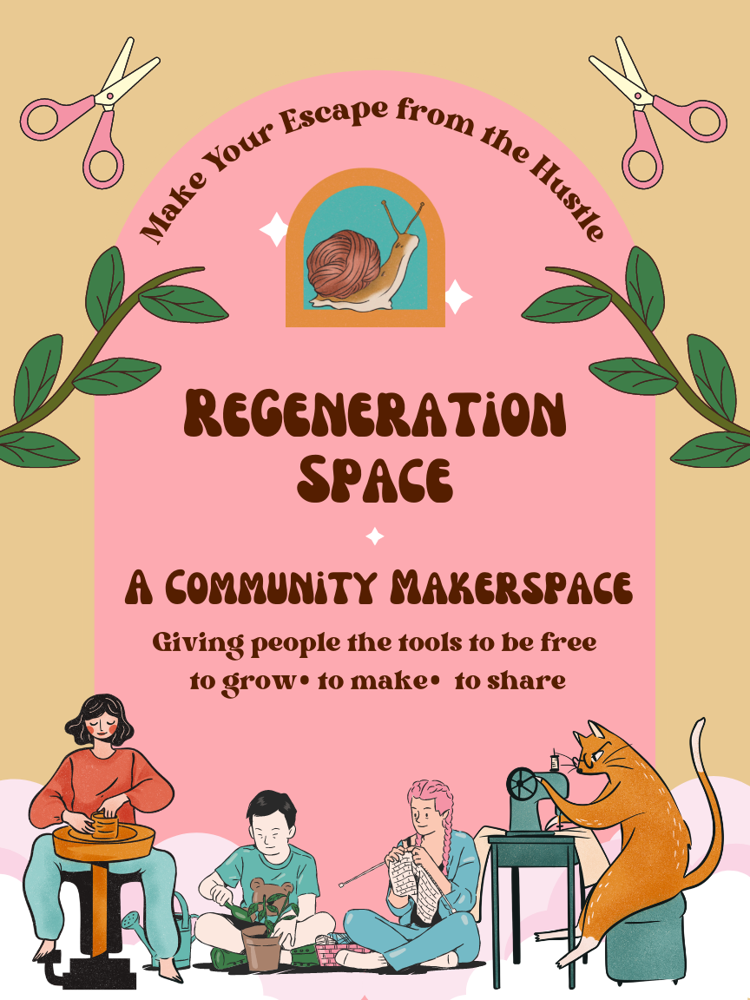
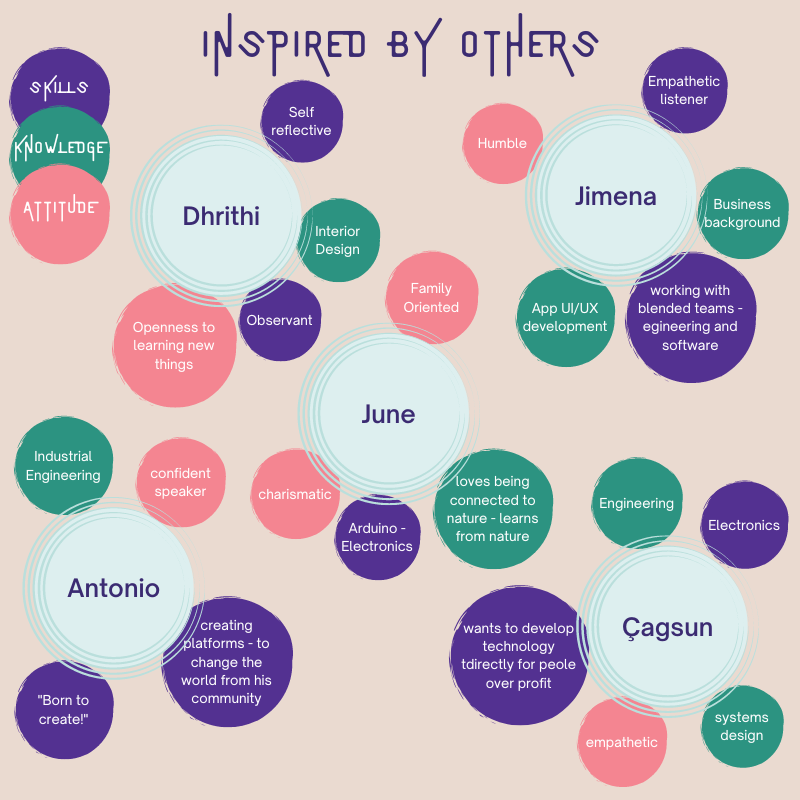
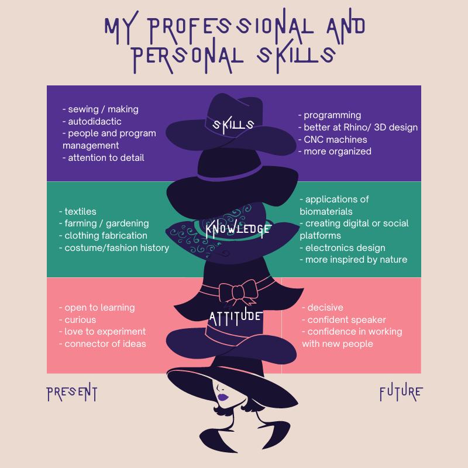

# MDEF Bootcamp

The first term started in October 2022. In this first week we were introduced to our instructors, classmates, and potential collaborators. We were also introduced to spaces at IAAC, Elisava, and around El Poblenou neighborhood where we will be working in this term. We learned how to set up our documentation websites and were given a few assignments to introduce ourselves to the group and start learning more about who we are and what we would like to get from the courses. 

## What is my fight? 

For our first activity we were asked to identify an issue, concern, cause or particular interest that we felt strongly about. From this idea we were asked to create a poster and bring it to the first day of class. 

I have a lot of causes that I connect with including regenerative and sustainable fashion and concern for the rights of workers in fashion and agriculture. Huge issues like climate change can be overwhelming the more I learn about all the ways it connects with our daily lives. Throughout the years I tried to address these issues on a personal level by doing things like making all my own clothes or not buying clothes for a year. Both of these approaches are really tough to stick to long term and I didn't really feel like they made a much of a difference addressing the huge issues anyway. When I started working at my university makerspace I had the realization that a lot of these issues must be addressed collectively and the makerspace was one outlet to do so. We organized a series of workshops teaching students how to sew and repair their own clothing. By becoming makers our university community became more connected to the stories of the people who made their clothes, where the clothes came from, and the impact on natural resources. 

I have a dream in the future to open an inclusive community makerspace centered around regenerative fashion and textiles. For this assignment I imagined a poster advertising this makerspace to the community. 

## Assignment: Vision, collaboration plan and personal development

Assignment: Create your own personal development plan for the master (1st Trimester).

- Create your design vision of how our (social) world could be in the (near) future
- Describe your professional identity in terms of skills, knowledge and attitude.
- Reflect on the “meetings” by analyzing what attracts you from their skills, knowledge and attitude
- Based on your vision and what attracts you from the “meetings” create your desired professional
identity
- Map the courses we are having this trimester in terms of what you have learned (for the past ones),
and what you would like to learn (ones to come).
- Justify and describe your personal development plan for the master program

### Vision
My design vision for how our (social) world could be in the (near) future. 

### Professional Identity

For this section we were first asked to describe our professional identity in terms of our skills, knowledge, and attitudes. Next we had the opportunity to have conversations with our classmates in the form of interviews and reflect on what attracts us to their skills, knowledge, and attitudes. 

### Map of MDEF Courses

For this part of the assignment we were asked to map the courses we are taking this trimester in terms of what we want to get out for the program. I chose to think if each course in terms of what I  want to practice, what I want to learn from each, and reflecting on my motivations for this. Lastly we were asked to justify and describe a personal development plan for the master program. 

|   Course        |  What I want to practice        |  What I want to learn         |  Reflecting on motivation          |
|:----------------|:--------------------------------|:------------------------------|:-----------------------------------|
| Atlas of Weak Signals   | Getting used to putting myself and my daily life in context of current trends |  Want to learn what it means to be hyper local | openness to connecting daily life to the future |

#### MDEF Personal Development Plan