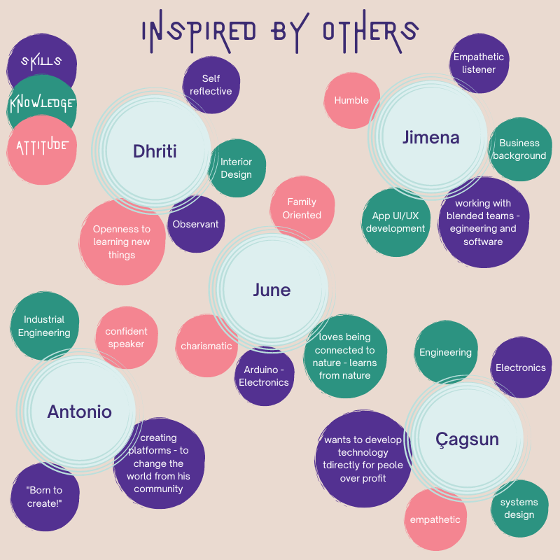

# MDEF Bootcamp

The first term started in October 2022. In this first week we were introduced to our instructors, classmates, and potential collaborators. We were also introduced to spaces at IAAC, Elisava, and around El Poblenou neighborhood where we will be working in this term. We learned how to set up our documentation websites and were given a few assignments to introduce ourselves to the group and start learning more about who we are and what we would like to get from the courses. 

## What is my fight? 

For our first activity we were asked to identify an issue, concern, cause or particular interest that we felt strongly about. From this idea we were asked to create a poster and bring it to the first day of class. 

I have a lot of causes that I connect with including regenerative and sustainable fashion and concern for the rights of workers in fashion and agriculture. Huge issues like climate change can be overwhelming the more I learn about all the ways it connects with our daily lives. Throughout the years I tried to address these issues on a personal level by doing things like making all my own clothes or not buying clothes for a year. Both of these approaches are really tough to stick to long term and I didn't really feel like they made a much of a difference addressing the huge issues anyway. When I started working at my university makerspace I had the realization that a lot of these issues must be addressed collectively and the makerspace was one outlet to do so. We organized a series of workshops teaching students how to sew and repair their own clothing. By becoming makers our university community became more connected to the stories of the people who made their clothes, where the clothes came from, and the impact on natural resources. 

I have a dream in the future to open an inclusive community makerspace centered around regenerative fashion and textiles. For this assignment I imagined a poster advertising this makerspace to the community. 

## Vision, collaboration plan and personal development

### Vision
My design vision for how our (social) world could be in the (near) future. 

I believe that making is a sort of interface with the world around me. Making is how I connect to people and learn about all the ways we are interconnected with materials and nature. If we all had the time and resources to be makers I envision that we would be a more content and connected society. 

### Professional Identity

For this section we were first asked to describe our professional identity in terms of our skills, knowledge, and attitudes. Next we had the opportunity to have conversations with our classmates in the form of interviews and reflect on what attracts us to their skills, knowledge, and attitudes. 

### Map of MDEF Personal Development Plan

For this part of the assignment we were asked to map the courses we are taking this trimester in terms of what we want to get out for the program. 

|   Weekly Course   |  Skills / Tools               |  Methods / Knowledge          | Goals / To be                 |
|:------------------|:------------------------------|:------------------------------|:------------------------------|
| 01 - Bootcamp     |      Setting up documentation website using git    |   Learning about classmates via interviews     |  documenting everything!     |
| 02 - Atlas of Weak Signals | Learn how to use the Atlas of weak signals as a tool to discover design interventions in the world | Want to learn what it means to be hyper local| open to connecting daily life to the future |
| 03/04 Biology & Agri zero |  exploring microscopic organisms, biohacking, bioplastics, robotics in agriculture        |    learn how to apply the scientific method in design, reading scientific papers    |   connecting my history of growing up on a farm to the future of agriculture  |
| 05 - Living with your ideas |   super quick prototyping to test ideas with myself   |   try out different/new 1st person research methods   |   to push myself to do something quickly instead of overthinking!  |
| 06/07 - Tech beyond the Myth |   electronics, Arduino, recycling   |   prototyping, exploration, play   |   To learn ways to combine things I have done in the past in new ways   |
| 08 - Community Engagement |     active listening, learning about communities in the area and ones we are working with    |    mapping    |    Open to everything, this all seems very new to me   |
| 09/10 - Extended Intelligences |   open source AI tools    |        |    How can this be useful to me as a designer?   |
| 11/12 - Design Dialogues |   collaboration, documentation, sharing, presenting my work   |      |   Also need to work on being able to (verbally)talk about my work in presentation  |

