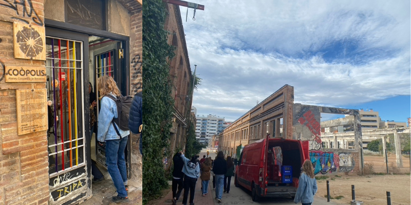
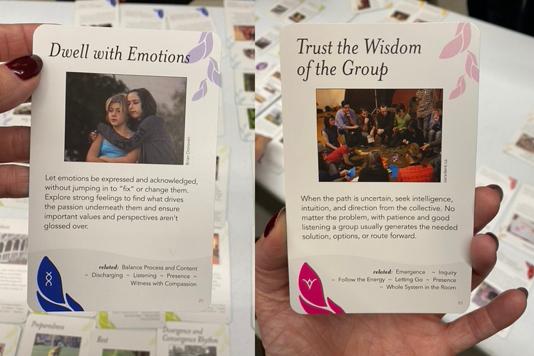
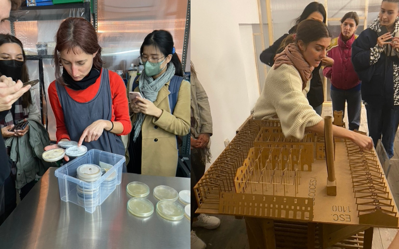
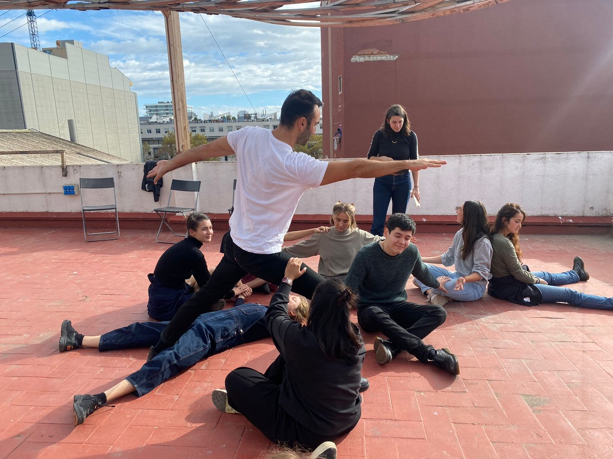

# Community Engagement

At the beginning of the week we visited Coòpolis and learned about the work being done by Holon from Mercè Rua and Markel Cormenzana. Holon is a design co-op that works with communities to help different kinds of transitions. Markel gave us a tour of the neighborhood around Coòpolis and discussed a cooperative housing project nearby that seemed really interesting. We also did an exercise on mapping the relationships within our own ongoing design interventions. Later in the week at Coòpolis we learned about facilitation and explored a card deck called "Group Works". We also did another exercise on creative communities which I have documented below. 

Back at the Fab Lab Barcelona we learned about the Siscode project from Melina Juarez. With this project they are trying to implement neighborhood scale circular economies. We also did an exercise where we got to role play some interactions from a case study based on a local community. With Melina we also visited visited a few creative communities around Poblenou throughout the week. I find the visits to the labs and communities some of the most useful and interesting parts of the MDEF course so far. 

## Reflections

I didn't know what to expect going into this week and I definitely learned a lot from Mercè, Markel and Melina. I had a little experience working with creative communities before while managing a university Makerspace. That experience was limited to mostly stakeholders within a university community. After this week I can envision how the work that I do and the experiences from my past can be applied beyond just a university community. Before this week I think I might have been intimidated to be part of any of the projects we discussed this week. The way they broke everything down and mapped it out made me realize that I could actually see myself participating in more community based projects. This week made me appreciate this type of work more and made me realize that I want to be more involved in things like this in the future. 

## Design Interventions in Creative Communities

*Creative Community:* 
Stephy's and Bright Beginnings, is a Cafe, Kids Recreation Center, and Event Space. Each month Stephy's collaborates with Mamas in Biz to put on a pop-up market for a group of local, women-led small businesses. 

*Context:* 
An idea for this design intervention came out of exploring the ideas and questions around how kids interpret nature. We are interested in learning more about how kids connect with nature. Our collaborator, Jordan Hodges, who recently moved to barcelona is going to be a father soon. Ultimately Jordan is hoping to raise his child in a way that is connected to nature. I am also interested in education and exploring different ways to interact with nature. When Jordan arrived to Barcelona he connected with a network of parents and care providers around Barcelona. One of these providers is Stephy's.  

*Current Situation:* 
When Jordan met Stephy he mentioned that we were graduate students looking to do educational interventions for kids. We met with Stephy again and proposed an idea to host a concert put on by plants for kids. She liked the idea and gave us some feedback on the structure and facilitation of the event. She helped us determine whether or not to structure it as a workshop or an event. She invited us to be the "entertainment" at an upcoming pop-up market event. The expectation is that lots of parents and their kids will attend the market and there will be opportunity for the kids to interact with the "Plant Band". 

*Engagement and Limits:*
Since the event is informal we expect to be interacting with people from all different age ranges. People will be coming and going throughout the day. If we had framed it as a workshop we could limit it to a specific age range to work with. I also expect that we will receive a lot of feedback and information on how to improve our intervention. I have done a few interactive exhibitions for kids in the past and I always find that there are surprises in how they interact that are never expected. This information is always pretty valuable and useful when doing future engagements. We will also have the opportunity to interact with both the kids and their parents at the same time which I think could be valuable. 

*Theory of Change:*
At this point I think we will mostly be learning from the kids and their parents. We hope that this interaction with the plants during this event will perhaps spark some conversations between the parents and their kids about nature. Ultimately we hope to learn enough so that we can start designing educational interventions for kids to connect deeply with nature. 

*Design Challenges and Opportunities:*
When we initially started thinking about the intervention we wanted to frame it more as a workshop where the kids would have the opportunity to listen to the plants and then be invited to tell a story based on what the plants are "singing". Our collaborator, Marielle, has experience doing workshops with kids and will design stickers for the kids to use in a storytelling exercise. Since we will be interacting with different age ranges for the pop-up event this activity will not be suited for all ages. I think we will gain some really useful information from this first intervention to design future interventions that are more structured and educational. 

