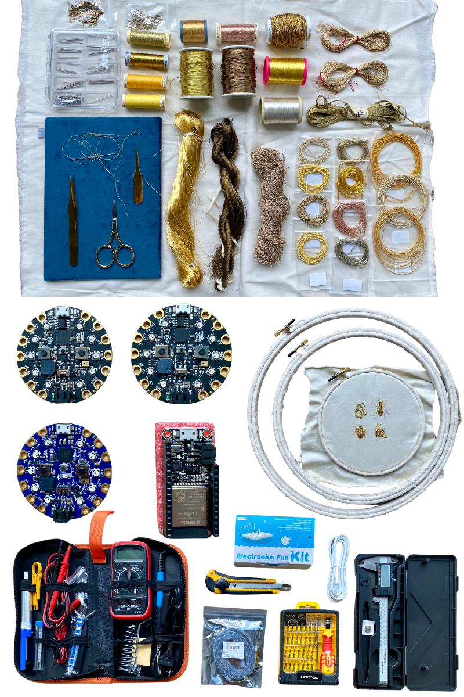

# Design Studio 1 - Roles of Prototyping

For our first design studio we learned about the roles of prototyping in design research. We were introduced to four different roles and asked to reflect which types of prototyping we have used in our deign processes and which ones we are interested in exploring further. 

The four roles of prototyping were defined as: 

1. Prototyping for experiments to test a hypothesis. 

2. Prototyping as an instrument for inquiry. 

3. Prototypes as a research archetype. 

4. Process of prototyping as a vehicle for inquiry. 

The first things that came to mind for me was when I use prototyping is in projects when I am testing new shapes or materials I have never used before. In the first case have used prototypes when designing and building costumes for theater or other performance. I have built prototypes to test movement for the performer in materials that can be rapidly put together for less cost than the final costume. This form of prototyping is primarily used as "hypothesis" validation in my process. I have an idea or desired outcome that I want to test before completing the final product. 

The second main way I use prototypes is when I test new materials that I have never used before for a new application other than what they are intended for. When building wearable technology where is a lot for me to learn about the materials newer to me (electronic components) as I am integrating them into textiles. This often requires me to explore the materials and how they work together before I can build them into a project. In this case I use prototyping as an instrument to explore the materials and learn more abut them. 

The last two roles of prototyping I have used less but I have thought of using both of them in different ways. I like the idea of using prototypes as a tool for critical design as part of my research practice. I have envisioned several projects like this I would like to try but I haven't had as many opportunities to build them.  

Using prototypes as a vehicle for inquiry is also very appealing to me as well. One project that I think uses this form of prototyping very well is and have mentioned on this blog previously is [The Embroidered Computer](http://www.ireneposch.net/stitching-worlds/) by Irene Posch. I really admire how they explore the intersection between traditional crafts and technology. I would be interested in participating in large collaborative design research projects like this in the future. I am looking forward to integrating both of these forms of prototyping into my process. 

## My Research Through Design Toolbox 

### Tools and Materials
When I moved to Barcelona I had to leave many of my tools and materials I am used to working with behind. I brought a few programmable microcontrollers and materials for metalwork embroidery. I am currently exploring metalwork embroidery as a way to apply circuits to textiles. Luckily when we arrived to IAAC we received a soldering and electronics prototyping toolkit. 

# Design Studio 3 - Communication Strategies

**Striving for continuity, creating a community.**
I think there is some value in connecting local makers with online making communities. This is something I thought about when I was overseeing a university makerspace. I think it would be interesting when maker educators are developing instructional materials for a workshop or class to create and host them on existent online platforms. Doing this would spread local knowledge online and also potentially serve to connect the local makers with the online community by encouraging them to go online and use these platforms. I think this could help strengthen communities both locally and globally. 

**Compiling the experiences you have already had to aid you when pitching or explaining your process to others that can help you move forward.**
One of the things I observed as a maker educator were the advantages of non-experts teaching others. I empowered my student staff to become educators in a university makerspace. Often beginners might have special insights on questions that others beginners or otters new to something might encounter. They feel empowered by sharing their new knowledge with others. They in turn feel like they have a more of a stake in the space and the community. 

**Offering visibility to others (human or non-human), serve as a bridge, showcase the work of others – can serve as a state of the art research process too.**
Facilitating and empowering others in a local makerspace to create their own diy tutorials and content to post online. Connecting makerspaces with existing online platforms as a way to share what they are doing and collaborate with other local makerspaces. 

**Experiment with new formats-mediums-platforms.**
Something I would like to try personally are creating tutorials on online platforms such as instructables, hackster, youtube, and tik-tok. Something that I am less great at is video documentation. My strength right now is primarily writing. I want to do some projects this term that are more focused on visual video documentation. If I have more knowledge on this I can better help others in creating their own documentation. 

## Next Steps - My Communication Strategy
- Make an instructional video or content to start getting used to online instructional platforms and communities. 
- Collaborate via workshop with classmates who are learning new things and work with them to make a tutorial/instructional video. “Beginners Making Things”
- Compiling past work in a makerspace to show my experience when I am talking to new people. 
- Curation - don’t reinvent the wheel. Use previous open-source tutorials and platforms already created for sharing information. 

