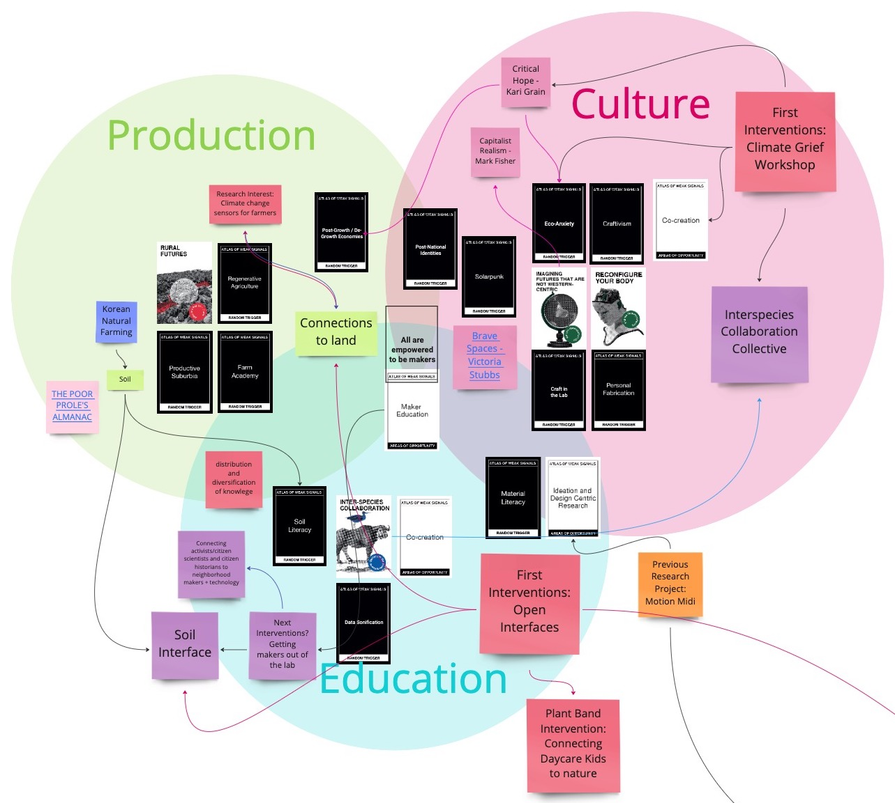
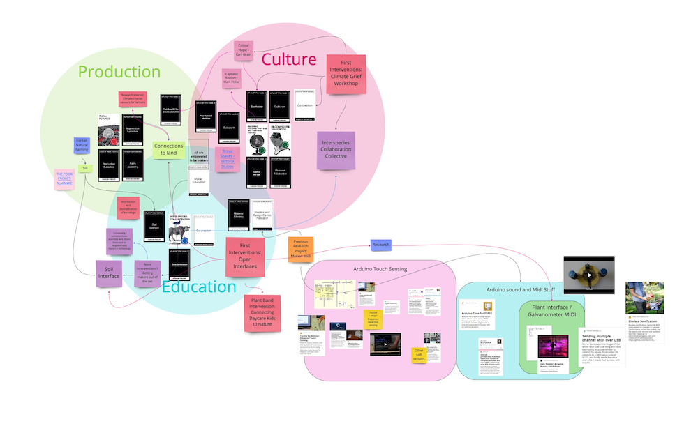
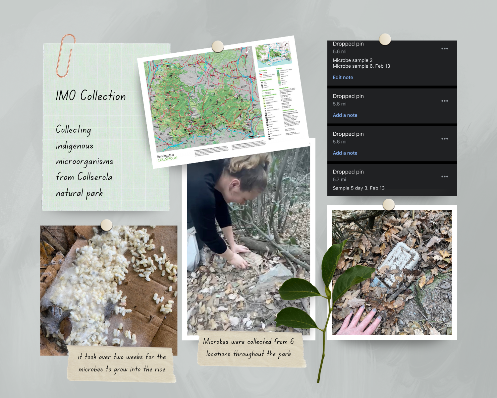
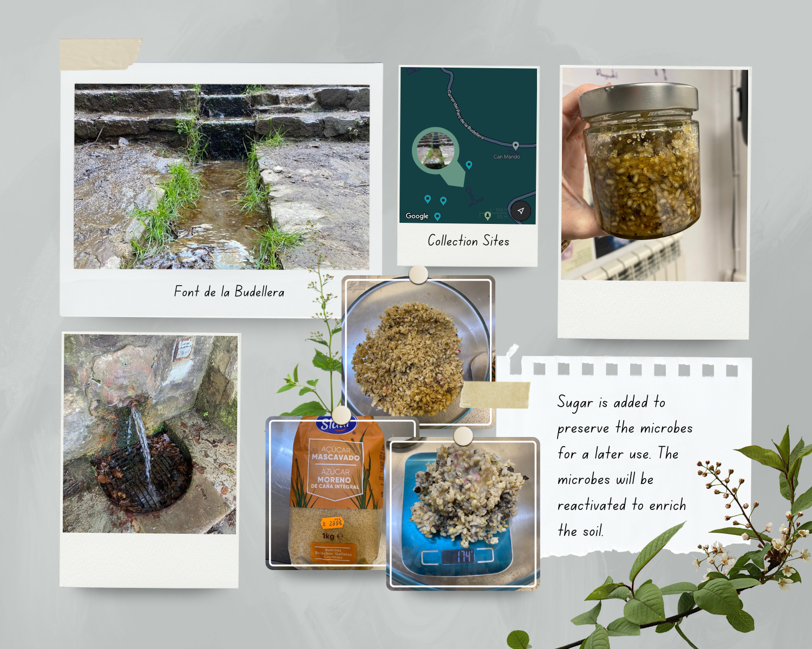
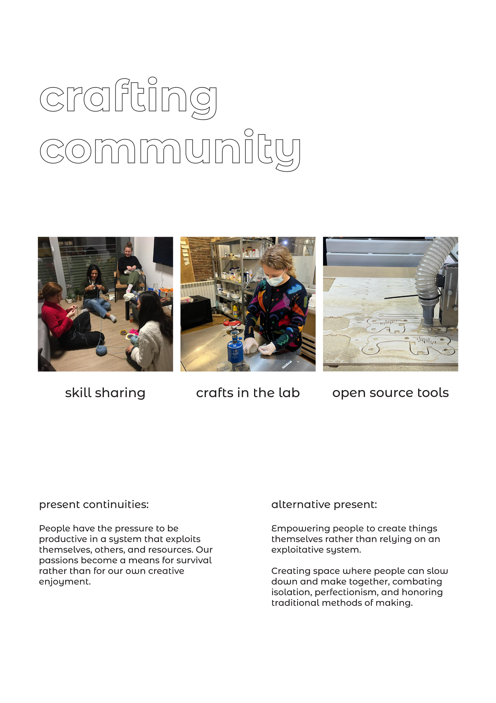

# Design Studio

## Reframing and Reflecting from Term 1

At the beginning of this term I have not really narrowed down the number of weak signals I am interested in. Instead I have replaced some of the ones from term 1 with new weak signals and triggers. One of the main ones I want to note is the addition of Interspecies Collaboration. After the Plant Band intervention I realized there are more opportunities to use this technology to interface with other species. I want to take the opportunity this term to explore soil ecologies and the "life underground". I plan to do this by collecting and cultivating indigenous microbes from the forest and learning from them.

I want to continue to explore more tools to interface between life and technology. Before coming to MDEF I designed several interfaces that explored alternative ways for humans to interface with computers. Most of these were in the form of wearable or interactive musical MIDI devices. I am really excited to expand my knowledge of these tools beyond just a human focus and start working with other species. In relation to this I created a new random trigger card called Data Sonification. I think Data Sonification in the Plant Band intervention example provides a way to make something like the biological processes of a plant more interesting and accessible to non-scientists and future scientists.

The Plant Band event is planned for January 22nd. As a result of some conversations I had before and during the Design Dialogues I am thinking of ways where the children can collaborate more with the plants. Rather than using them as instruments I think it could be more meaningful interspecies collaboration if the children were able to add their own biological music to join in with the band as they are playing. I am sure we will get a lot of valuable feedback from the parents and kids at the event. That being said I am not sure if our group is as interested to continue working with children going forward. One of the key takeaways from the planning process of this intervention so far has been to be open to the needs of the community. We might approach a community with ideas on how to intervene but it is best to be open and flexible to adjust to the needs of the community. We don't need to bring ideas but rather a set of skills. One of the benefits of being creative is that there is usually no shortage of ideas and therefore no need to approach a community with so many pre-made ideas and solutions.

In the first term I also learned that not every critique means I need to change direction completely. Sometimes it might mean I just need to work on how I am communicating my ideas. I didn't agree with some of the feedback I received on the Climate Grief intervention from last term. A few people had some issues with the focus on the word grief and were concerned that "dwelling in grief" could lead to inaction. I think it is important to make space for difficult feelings and topics within a community working on tackling ecological challenges. At the end of last term I resolved to try and work on my execution and communication on the importance of addressing anger and grief within our community spaces. At the beginning of term 2 we had a course on Designing for the Next Billion Seconds. This week I was introduced to the concept of Critical Hope (Kari Grain 2022). I read the introduction to her book and think she beautifully frames my perspective on this. It was really validating to read and I am looking forward to exploring this concept of critical hope further this term. I think ultimately if I stick to my values and learn to communicate them better then I am on the right track.

The Climate Grief workshop was part of a larger project proposed by my collaborator, Paige. She plans to propose an exhibition of a series of resilient species encased in resin placed around Barcelona. The artifacts are part of an educational sort of scavenger hunt that speculates about how the species will be useful in the Post-Mediterranean climate of a future Barcelona. She imagined that the information encased in the resin was placed there by an interspecies collaboration collective. After our workshop I suggested that we explore further what such a collective would look like if we started forming it today. This term Paige and I plan to start exploring this concept as well as the practical steps to actually encasing these species in resin for the exhibition.

My final learning point from the last term is to start earlier! Once I have an idea I just need to get going instead of spending so much time in the planning phase. When I took art classes I found this kind of exploration coming more naturally to me. My former sculpture teacher would always say "work makes work". When studying design there has typically been more research and planning but sometimes I can get stuck there. I would like to find a balance between the two disciplines. Overall I am very excited to start working exploring my new weak signals, learning new tools to interface with the world, and researching new concepts to help me communicate my ideas more clearly.

### Next Interventions
My first interventions will be related to exploring soil ecologies as mentioned above. For the first step I will collect soil microbes from the forest according to the Jadam natural farming practices that I researched last term. That process will take at least 10 days. In the second phase I will start listening to the soil microbes with an interface similar to the one built for the Plant Band intervention. I not exactly sure what I will learn form doing this but I know I'll learn something as I go through this process. 

## Interventions  

This term I conducted a series of interventions collectively involved both human and non-human communities as well as communities around Barcelona and more distant communities. All of these interventions were carried out by involving myself personally in different ways.  

### Collecting Microbes  

The first intervention I staged involved cultivating microbial communities outside Barcelona and bringing them into the city to benefit local plants. The first part of this intervention took place over the course of a month. The microbes were collected from 6 different locations in Collserola Natural Park, one of the few old growth forests left in the area. The collection of these indigenous microorganisms were done according to the JADAM Korean natural farming methods. Cooked rice was left in a breathable, in my case cardboard, box for a couple weeks each time. I placed the boxes next to the soul under old growth trees and covered them with a layer of leaf mould. The rice invites a diverse collection of soil microbes to grow. This inoculated rice is taken back to the lab and the microbes are put into a dormant state by adding equal parts by weight of brown sugar. This completes the first step in the method of making “IMO 2”, Indigenous Microorganisms. 

  
  

The most meaningful thing I was able to take away from this was my learnings about communities through observing microbes and their relationships to plants. The diverse community of microorganisms supports the plants that are growing in the soil. I think the intervention with microbes sheds light on the resilience of a diverse community. We often think of plants as stand-alone entities that only need food, water and sun to survive. Plants, like humans, are supported by a complex system of energy and nutrient flows enabling a biodiverse collection of microbes. Our understanding when we talk about microbes is “good bacteria” vs “bad bacteria” but the truth is that it is more a complex web of biodiversity that keeps a system resilient and healthy. I think the knowledge we can learn from microbial communities that support life can be scaled up to the type of communities we need to nurture and encourage to bloom around us.  

### The Growing of a Citrus Tree  

The next intervention involved the collective care of some citrus trees my friend, Kelly, is taking care of for me back in Virginia. Through a series of messages we collectively support the trees and each other through our friendship. Kelly picked up songwriting during the pandemic as one of her many passions and composed a song about the trees and our friendship. In this intervention I explored autoethnographic ways of documentation. Some of the exchanges are very personal and discuss our mental health and how we have supported each other through the years. I chose to only share the portions related to the citrus trees due to the personal nature of the content. Through these exchanges I reflected on what it means to be far away and disconnected from community, the difficulty of caring for others over a long distance, and ways to stay connected through collective care of plants. 

  <iframe loading="lazy" style="position: absolute; width: 100%; height: 100%; top: 0; left: 0; border: none; padding: 0;margin: 0;"
    src="https:&#x2F;&#x2F;www.canva.com&#x2F;design&#x2F;DAFj7guG6N0&#x2F;view?embed" allowfullscreen="allowfullscreen" allow="fullscreen">
  </iframe>

<a href="https:&#x2F;&#x2F;www.canva.com&#x2F;design&#x2F;DAFj7guG6N0&#x2F;view?utm_content=DAFj7guG6N0&amp;utm_campaign=designshare&amp;utm_medium=embeds&amp;utm_source=link" target="_blank" rel="noopener">Growing of a Citrus Tree</a> by agjarv

## Alternative Present

All of the interventions I did in term II were definitely connected to eventually lead us to the idea of crafted communities. Along the way we realized that we are unhappy with the pressure that we have to be productive in a system that exploits us, others, and resources.  We are also frustrated that in this system our passions become a means for survival rather than for our own creative enjoyment. During the process of this intervention Sami and I came to the following alternative present where people are empowered to create things themselves rather than relying on an exploitative. We want to create a space where people can slow down and make together, combating isolation, perfectionism, and honoring traditional methods of making.

  
