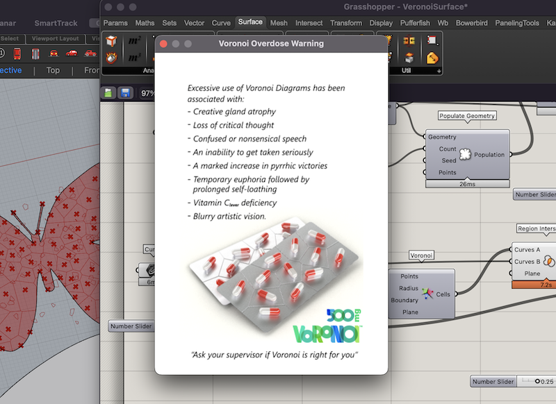
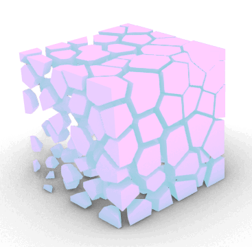
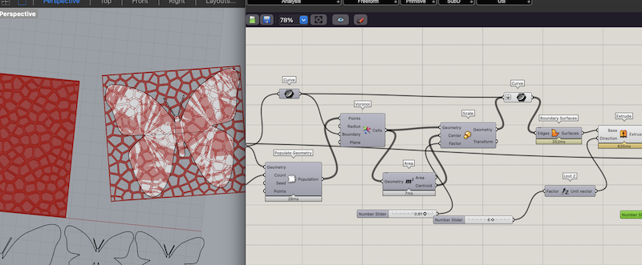
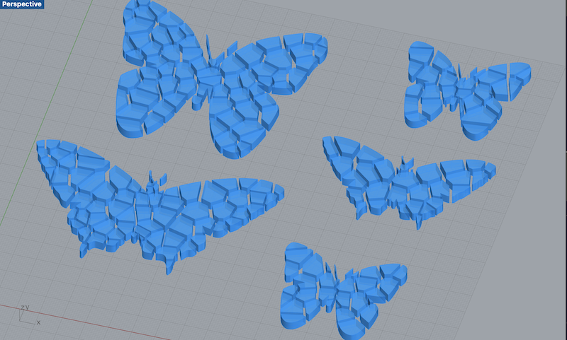
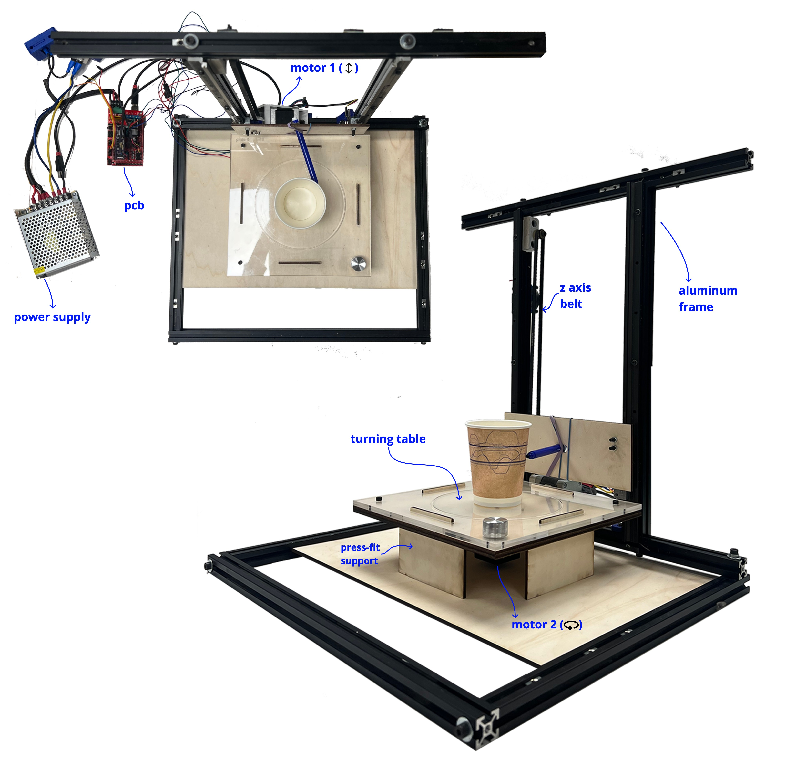

# Digital Prototyping for Design

## Electronics and Coding

<iframe src="https://player.vimeo.com/video/800695881?h=93c8090f85&amp;badge=0&amp;autopause=0&amp;player_id=0&amp;app_id=58479" frameborder="0" allow="autoplay; fullscreen; picture-in-picture" allowfullscreen style="position:absolute;top:0;left:0;width:100%;height:100%;" title="Ribbon Potentiometer"></iframe>

The task for this day was to make some music with an Ardunio compatible board using a buzzer as an output. I started with some built in examples using the tone() function. To take it further I wanted to find a more interesting way to control the sounds rather than using a programmed melody. I started out with a potentiometer to control the pitch using the Arduino tone() function. This function generates synthesized square waves. 

I am interested in making a version of this [paper synthesizer](https://www.instructables.com/PaperSynth-an-8-bit-Synthesizer-Made-Out-of-Paper-/) eventually. I wanted to see if I could make my own ribbon potentiometer instead of buying the soft potentiometer that they suggest. I found a couple resources online that I have linked below in references. I made a quick prototype out of an old TMB (metro) card, some conductive tape, and a strip of Velostat. 

It took quite a bit of testing and research to figure out how to get it to work properly since I know very little about electrical engineering. When I first plugged the sensor in it was reacting to touch but also still jumping all over the place when it wasn't being activated. I realized I needed to add a pulldown resistor to keep it at a zero value when it was not pressed. That resolved the problem of it making sounds when touched. I had another issue of it being jumpy and playing multiple notes when it was touched. I solved that by smoothing the analog input from the sensor. I had some problems getting it right and kept getting an error. I went and asked ChatGPT to help me figure out where I was going wrong and I got a great answer! ChatGPT explained to me exactly where I went wrong and suggested a few lines to fix the mistake. I got the paper potentiometer working really well but I was getting sick of the Ardunio tone() screams and beeps. 

I decided to explore the Mozzi Library a bit. Mozzi uses oscillators and filters to make way more interesting sounds. I tried out some of the example codes with the paper potentiometer and was pretty cool. In the future weeks I am interested in making a diy synth based on this paper potentiometer and the Mozzi library. 

(use the arrows to see the other pages of the presentation)

  <iframe loading="lazy" style="position: absolute; width: 100%; height: 100%; top: 0; left: 0; border: none; padding: 0;margin: 0;"
    src="https:&#x2F;&#x2F;www.canva.com&#x2F;design&#x2F;DAFaf9KXaPw&#x2F;view?embed" allowfullscreen="allowfullscreen" allow="fullscreen">
  </iframe>

<a href="https:&#x2F;&#x2F;www.canva.com&#x2F;design&#x2F;DAFaf9KXaPw&#x2F;view?utm_content=DAFaf9KXaPw&amp;utm_campaign=designshare&amp;utm_medium=embeds&amp;utm_source=link" target="_blank" rel="noopener"> Electronics and Coding Lab Notes</a> by amanda

### References 

- [Arduino Tone Generator](https://diyelectromusic.wordpress.com/2020/06/01/arduino-tone-generator/) by Kevin at diyelectronicmusic.wordpress.com

- [Ribbon Potentiometer](https://www.instructables.com/Make-a-Ribbon-Controller/) on Inscrutables

- [DIY Resistive Ribbon Sensor](http://www.ooooo.be/devices/ribbon4/ribbon4.htm)

- [Analog Input Instructables](https://www.instructables.com/Analog-Input/)

- [Mozzi Library](https://sensorium.github.io/Mozzi/examples/)

- [Paper Synth](https://www.instructables.com/PaperSynth-an-8-bit-Synthesizer-Made-Out-of-Paper-/) by Bryan Cera

## 2D/3D Design Tools

For this activity we were tasked with creating a 3D design based on algorithmic thinking of any object. I chose to work with Grasshopper. I have taken a few classes and tutorials on this over the last several years but I don't use it so I tend to forget everything I learn. I am hoping to use it more this term and hopefully retain some of what I learn. 

I started out by following a grasshopper beginner tutorial online. 

playing with attractor points

I started following some more grasshopper tutorials and decided to work on using some of SVGs that I created in some previous weeks as a starting point. This proved to be way more difficult than I realized. It is hard (for a beginner) to get the Voronoi tesselation to work in a non-rectangular surface. 

Eventually after many hours, errors, and warnings of Voronoi overdose from Grasshopper I managed to get something I could use. 

Voronoi tessellated butterflies

I was using some similar designs last year during Fabricademy that I #D printed onto fabric during the [Computational Couture](https://class.textile-academy.org/2022/amanda-jarvis/assignments/week07/) week. Before when I made them I had to start with a square of the tesselation and then cut the shape out that I wanted each time. With this parametric version I can import any SVGs and convert them to this pattern that is nice for 3D printing on fabrics. 

### Files

[VoronoiSurface.gh](../images/term-02/digital-prototype/VeronoiSurface.gh)

[voronoiButterflies.3dm](../images/term-02/digital-prototype/voronoiButterflies.3dm)

### References

[Grasshopper Beginner Tutorial](https://www.youtube.com/watch?v=zDDVeDldvaI)

[Grasshopper Voronoi on Surface](https://www.youtube.com/watch?v=YDFofhlWNxs)

## 2D Fabrication

Work in progress. I missed this day and am still waiting to laser cut. 

## Inputs and Outputs

Work in progress... I spent too much time working on my potentiometer and didn't get into this yet. 

## Micro Challenge 1

We were given a "Micro Challenge" to design and build a tool or artifact to help in the process of designing, creating, thinking, or collaborating with others. For this challenge, I teamed up with Myrto and Seher. We come from different professional backgrounds, and it took us a while to think of an idea that would align with all of our research interests. Eventually, we settled on the question: what if we could store data inside the objects we use in our daily life?

We were inspired to explore the concept of measuring from a hyper-personal perspective in a post-scientific way. We asked each other questions, such as when does measuring stop facilitating and start preventing a process? Are the usual measuring units contrary to replicability? Why do we measure things? Is it to save time instead of doing everything by trial and error, or for capitalism and control outcome prediction? We also wanted to explore other fields, such as storytelling and the strict binary distinction between the "positive" and "negative" of molds and objects.

We began designing a tool that could encode audio messages onto the surface of everyday objects. This machine would be able to take audio input in real time, process it, and emboss it onto a ceramic cup, similar to how sound can be recorded onto a vinyl record. The messages will be engraved onto ceramics, and cups, pots, and other objects will become carriers of our stories that will travel through time. It is a concept that deals with continuity and archiving.

We knew this would be an ambitious artifact to make, and we most likely wouldn't be able to complete it in the four days of the first micro challenge. We planned to make the first iteration of the prototype this week, which consists of a motorized turntable and an arm that could move up and down and hold different toolheads such as a pen. This first iteration was designed to write on a paper cup and test out our idea. We hope to make improvements to the design in subsequent micro challenge weeks.

Although we come from different backgrounds, I think this allowed us to make a lot of progress in a short amount of time. Each of us had strengths that we were able to contribute to the group work this week. In the last few days, I spent a lot of time learning about how to program microcontrollers to control the two servo motors we needed for this prototype. I had never programmed a motor before, so this was all new to me. It was really fun, and I am looking forward to getting more into it in the coming weeks. My teammates focused on the design and fabrication of the turntable and started exploring the sound sensing piece of the project. We didn't have time to connect the sound input to the project, but we will be exploring that in the coming weeks. This week, we managed to build a simple and nice turntable and motorize it, as well as create a frame for the z-axis that will serve as an interchangeable toolhead for pens and carving tools.

Check out the full project on our [GitHub](https://github.com/SeherKrishna02/Andaaza)

  <iframe loading="lazy" style="position: absolute; width: 100%; height: 100%; top: 0; left: 0; border: none; padding: 0;margin: 0;"
    src="https:&#x2F;&#x2F;www.canva.com&#x2F;design&#x2F;DAFaumtP7p8&#x2F;view?embed" allowfullscreen="allowfullscreen" allow="fullscreen">
  </iframe>

<a href="https:&#x2F;&#x2F;www.canva.com&#x2F;design&#x2F;DAFaumtP7p8&#x2F;view?utm_content=DAFaumtP7p8&amp;utm_campaign=designshare&amp;utm_medium=embeds&amp;utm_source=link" target="_blank" rel="noopener">Andaaza</a> by Seher, Myrto, & Amanda

### References for Later

[Adaptive Morse Code Detector](https://www.hackster.io/shjin/adaptive-led-morse-code-decoder-and-timer-interrupt-8d18a7)

[Pulse Counter](https://forum.arduino.cc/t/pulse-counter-and-time-measurement/904085/12)

[Photocell Reading](https://learn.adafruit.com/photocells/arduino-code)

