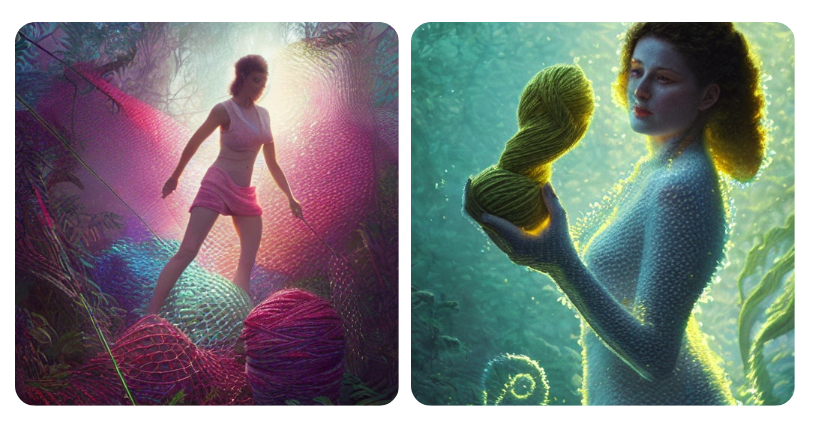

#  Reflections: Making Sense and Meaning

For this course we were presented with a number of readings and three questions to consider as designers. 

How design can reconfigure systems of extraction?

Which worlds can we design with the power of today’s tools?

How can we design the transition towards these worlds?

## "Nothing" is Not Really Nothing

My friend recently told me about an article she read, which stated that "nothing" is not really an absence of matter, but rather a concept. Scientists have discovered that we are actually floating around in a sort of quantum foam, and that space is not empty at all. It's in human nature to simplify things into easily verifiable and repeatable facts. However, as we continue to pursue knowledge and understanding, we realize that everything is much more complex than we originally thought. The more we learn about the universe, the less useful absolutes become. Humans are narrative creatures, and our stories fill in the gaps between our understanding and create the foam in which we suspend our reality.

### Origins: The Power of Storytelling

I like to imagine that knowledge of where we came from is actually encoded in human DNA as stories. Gregory Bateson, in his reading "Steps to an Ecology of Mind," noted the similarities of our human origin stories all over the world. In "Sand Talk: How Indigenous Thinking Can Save the World," author Tyson Yunkaporta also notes that people have had similar threads running through their origin stories and that indigenous cultures have had an understanding of physics and origins of the universe long before Western science made "discoveries."

It's interesting to think of science as another form of storytelling. In our current technology-obsessed reality, the dominant culture places more emphasis on gathering and presenting data by institutionalized science as being more "valid" than other forms of narrative. While technology can be useful, it's also a double-edged sword. For example, I used AI to assist me in creating graphics to accompany this essay, but the results were limited. When prompted with the keyword "woman" and other words, the AI generated images of thin, white women, highlighting the narrowness of its scope.

Growing up on a prairie at the edge of the world, I had to work on a farm at a very young age. My sister and I would escape into imaginary worlds to avoid work, but as I got older, I stopped talking about where I came from, thinking it didn't matter. However, I realize now that it's a part of who I am. I come from generations of people who had to work from a young age and care for the land. Now, I'm trying to confront unfair labor practices and think about the concept of "doing nothing." If nothing doesn't exist, are we ever really doing nothing? What stories are we told about work versus non-work? I believe we need to redefine or even abolish this binary to create a more equitable society.

### Embracing Change: Letting Go of the Current Way of Doing Things

Grief and letting go are essential to the changes that need to happen for us to move beyond the illusion of zero waste and taking full responsibility for our impact on the planet. This means going beyond simple solutions like recycling and embracing the difficult and transformative changes that are necessary to create a sustainable future. However, this requires a fundamental shift in our way of life, one that is difficult to imagine within a capitalist world where it may feel like a sacrifice or giving up a part of who we are. We must be willing to embrace the unknown and accept that change can be scary. But if we don't change, we risk being unprepared for the pending changes that will inevitably come. It's important to remember that the future is not singular, and out of a single loss, many possible futures can be born. But we cannot replace what is lost with nothing, for "nothing" doesn't actually exist.

### Redesigning Systems for Community and Resilience

Design has the potential to reconfigure systems of extraction. One idea I particularly like from the History of Seven Cheap Things is the notion of redistributing care, land, and work so that everyone has an opportunity to contribute to the improvement of our lives and that of the ecology. The book also emphasizes the importance of systems that invite participation rather than demand interaction. Being in a community means inviting people to be part of something, not extracting from them. As a designer, I believe I can enable others to see the possibility of making something instead of depending on capitalism to produce it. I can offer a glimpse into many possible futures and help us move away from the mindset of separating ourselves from nature. We must start viewing ourselves as part of nature and build systems that are resilient and circular, mimicking nature’s ways.

Over the last few years, we have witnessed the fragility of systems that are removed from nature, exemplified by the pandemic. This presents an opportunity to rethink and replace some of these systems with ones that are more resilient. Redistributing care, land, and work is one way to begin. We need to move away from the linear cycle of destruction and embrace a circular way of living that respects and mimics nature.

In addition, we need to make space for healing, recovery, and repair. We must hold space for difficult emotions such as grief, anger, and sadness. It is only by acknowledging and making space for these emotions that we can move forward and transition to a world where all life is sacred and everyone has the right to exist. As a community, we can invite everyone to be part of this transition and create a better future for ourselves and the planet.

### Designers as Agents of Change: Redefining Our Role in Society"

As designers, we have the power to shape the world around us. We have a responsibility to use our skills and creativity to design a better future for all beings on this planet. The issues we face today are complex and intertwined, but we can start by asking ourselves some important questions:

How can we design for a more sustainable future? How can we create systems that are regenerative, rather than extractive? How can we ensure that everyone has access to the resources they need to thrive?

It is time for us to move beyond traditional design thinking and embrace a new paradigm that puts people and the planet first. We must challenge ourselves to think creatively and collaboratively, to listen to diverse perspectives, and to engage in deep, empathetic understanding of the world around us.

We must also recognize that our work as designers is inherently political. We cannot simply design for aesthetics or functionality alone - we must actively work towards a more just and equitable society. This means understanding and challenging power structures, working towards dismantling systems of oppression, and creating inclusive designs that serve all communities.

It won't be easy, but it's necessary. We have the opportunity to create a world that is more just, more sustainable, and more beautiful than the one we inherited. Let's rise to the challenge and use our skills as designers to make a positive impact on the world.

## References

- [https://bigthink.com/hard-science/nothing-exist-quantum-foam/](“Nothing” doesn’t exist. Instead, there is “quantum foam”)
- [How Humanity Came To Rule The World | Yuval Noah Harari & Neil deGrasse Tyson](https://www.youtube.com/embed/e77a-SweV9o)  
- [Design as participation:](https://jods.mitpress.mit.edu/pub/design-as-participation/release/1)  
- [A History of the World in Seven Cheap Things:](https://www.researchgate.net/publication/319143816_A_History_of_the_World_in_Seven_Cheap_Things)  
- [Steps to an Ecology of Mind:](https://ejcj.orfaleacenter.ucsb.edu/wp-content/uploads/2017/06/1972.-Gregory-Bateson-Steps-to-an-Ecology-of-Mind.pdf)
