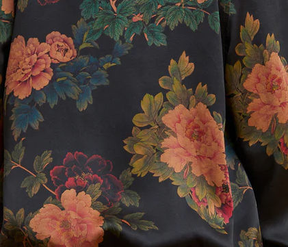
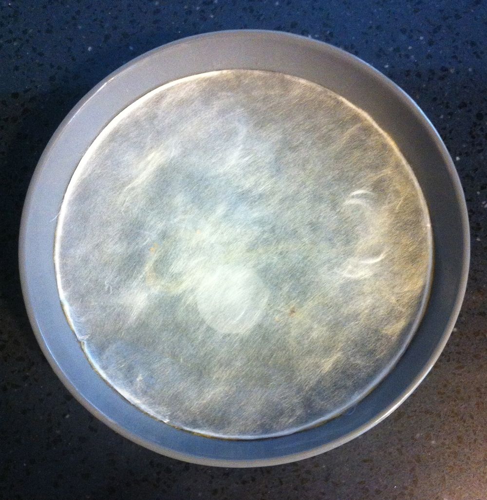
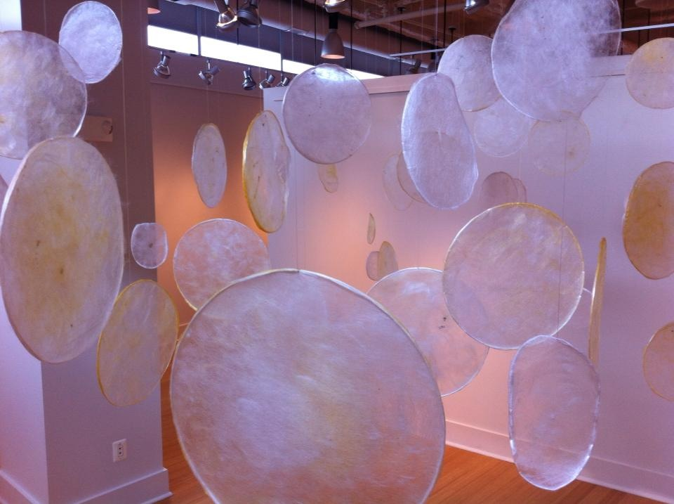
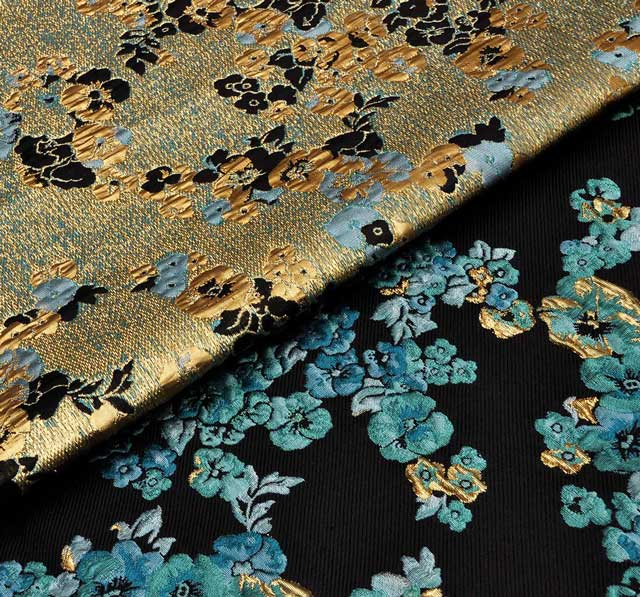

# Remixing Materials

## Material Narratives

I was first tasked with assessing three different materials. I'll look at a material from around me, one from a reference and imagine one new material. I chose to focus on textiles because I am a textile nerd and can't resist a great narrative about a special textile tradition and I am excited about the future in this area. 

^^**xiang yun sha (pronounced SHUNG YOON SHAH)**^^

This is a beautiful type of silk I have hanging in my closet (from [The Ziran](https://theziran.com/)). This silk has been produced sustainably in Southern China for 500 years. This silk is produced in one small village with minimal energy and no chemicals. The cloth is dyed with yams and iron rich mud from the river all with the help of the sun.

This cloth celebrates a long tradition in how it has been produced sustainably for 500 years. I find it interesting how we think a lot about sustainability in the future and at the same time so much can be learned from the past. This cloth is dyed with natural plant dye, mud, and the sun. The resulting fabric is one of the most beautiful textiles I own. It is the sort of think I will keep for the rest of my life. I can't always say that for most of the modern clothes I buy. There is something almost magical about the resulting cloth. It can't be replicated by manufacturing because then it wouldn't be what it is. It wouldn't be 500 years of handcrafted tradition. I do believe that we have to go back to an appreciation for handcraft over manufacturing. I believe the future is crafted and not manufactured. 

Something I find interesting is how a lot of culture, craft and traditions have been lost to time and colonialism and yet in a lot of academic settings there is this attitude of "discovery" as if these things are new. Things were done in circular and sustainable ways at one point before any institutions existed. It is the way of nature. The ability to craft things in a circular way is in our DNA. This is what still gives me hope. Seeing that materials like xiang yun sha still exist in the world give me hope. 

<iframe src="https://player.vimeo.com/video/253073951?h=066b421348" width="640" height="360" frameborder="0" allow="autoplay; fullscreen; picture-in-picture" allowfullscreen></iframe>

<a href="https://vimeo.com/253073951">The Ziran Way Film</a> from <a href="https://vimeo.com/user58255798">Ziran</a> on <a href="https://vimeo.com">Vimeo</a>.

^^**Bombyx mori collaborative materials**^^

I have seen many projects where designers and artist collaborate with Bombyx mori (domesticated silkworms) to create a nonwoven silk material. Rather than spinning their cocoons the silkworms are coaxed to spin their silk strands across an armature. The silk resulting from the process is not woven in a traditional (human) way. It is pretty fine and transparent. Since it is nonwoven it might be difficult to turn it into a traditional cloth that can be cut and sewed. 

We had one of the more well known projects (Silk Pavillion) mentioned in class so I wanted to highlight the work of conceptual artist, Elsabe Dixon. She has been growing silkworms since her childhood in South Africa. I appreciate her approach to working with the silkworms as collaborators as she explores spiritual expression, labor and time. 

Alchemical Vessel - Elsabe Dixon 2014

This is Labor - Elsabe Dixon 2013

 In traditional sericulture the silkworms are boiled alive to remove them from their cocoons. This allows the cocoons to be unwound in long strands. If the silkworms are allowed to complete their life-cycle they break through the cocoon and break up the long strand of silk. In the production of most silk the worms are killed to prevent them from breaking their cocoon. Silk threads can them be woven into cloth. I think it could be interesting for the non-woven silk mentioned above to be used in bioplastic composites to reinforce them. 

^^**Bacterial Silk?**^^

If I could imagine a material I think it would be interesting to make silk from bacteria. Bacteria could be engineered to produce long fibers of silk-like proteins that can be spun into very fine threads. 

When textiles are dyed at an industrial scale a lot of water is used. There are many chemicals used in this process that make their way into polluting local ecosystems as well. The bacteria could also be engineered to produce pigment that could "dye" the fibers as they are being produced. This could potentially cut down on the amount water and energy needed to produce and dye a protein based silk-like fiber. The resulting pre-colored yarns could be woven with traditional techniques or knitting that take advantage of pre-dyed yarns. Examples of these weaving techniques can range from what you can see in [jacquard](https://tissura.com/articles/jacquard-fabrics) or denim (twill). 
 
 

## Materials Exploration
 
 For these weeks I was collaborating with Carolina. After the lectures we were most interested in experimenting with extracting colors from food waste and learning more about structural colors. We ultimately chose to work with spent coffee grounds we sources from the coffee shop next door to our school. We chose to take a critical approach in exploring coffee and the industry surrounding it. 

I found a sheet of a vinyl window covering at the hardware store that is used for privacy and decoration. I noticed that it had a diffraction grating texture that might be copied by casting the bioplastic on top. I had experimented with these sorts of surfaces previously in 3D printing and then later in Fabricademy during our biomaterial week. We chose to work mainly with a gelatin bioplastic base to work with because it has less shrinkage and might copy the surface the best. The first batch was clear and it was easy to peel off after two days. 

For the next batch we boiled the coffee grounds the extract the color. We filtered the coffee grounds from the water and used the resulting coffee water to replace some of the water in the gelatin recipe. We followed the same method as before. (Recipe is below)

We also made some gelatin bioplastic materials with the boiled and dried coffee grounds as additives. This resulted in a very leather-like material. 

For the gelatin-prism film we used a combination of paper punched and laser cutting to shape it. I sewed some of the paillettes and sequins onto some silk fabric, also dyed with coffee. The gelatin butterflies get sticky when dampened and were able to be stuck to glass windows as suncatchers. 

Lastly, we are in the process of testing the material as a growing medium for chia seeds. My collaborator, Carolina, would like to explore making biologically active "graffiti" that can be placed in urban areas. We are hoping to be able to laser cut gelatin filled with chia seeds and adhere it to different surfaces to see if it can grow. Our final application for all of this is a message relating to the intersections between farm workers, transparency in supply chains, and the idea of the circularity on a global scale. 

  <iframe loading="lazy" style="position: absolute; width: 100%; height: 100%; top: 0; left: 0; border: none; padding: 0;margin: 0;"
    src="https:&#x2F;&#x2F;www.canva.com&#x2F;design&#x2F;DAFZd7WabaI&#x2F;view?embed" allowfullscreen="allowfullscreen" allow="fullscreen">
  </iframe>

<a href="https:&#x2F;&#x2F;www.canva.com&#x2F;design&#x2F;DAFZd7WabaI&#x2F;view?utm_content=DAFZd7WabaI&amp;utm_campaign=designshare&amp;utm_medium=embeds&amp;utm_source=link" target="_blank" rel="noopener">Coffee-BiomaterialExploration</a> by agjarv

### Gelatin Bioplastic Recipes

> :memo: **Gelatin Bioplastic Film**
>
> - 240ml of water (or coffee water)
> - 48g of gelatina triturada
> - 14ml of glycerol
> - take the water to 60ºC
> - add the glycerol and stir
> - add the 48g and mix until you get a homogeneous solution
> - simmer for 5 minutes (do not boil)
> - let it cool down slightly
> - pour it into the micro-textured sheet
 
It is best to let it cure for 1-2 days. Peeling too soon can cause the gelatin or the plastic sheet to tear. The edges start lifting off the sheet on their own. In this project the gelatin is poured directly on the sheet without a frame the obtain a really thin film that can by punched with paper punches. The results of copying the prismatic surface with thicker sheets of gelatin are less desirable. It seems to need to be able to shrink organically in order to copy the micro-texture. I have found that the frame and a thicker gelatin sheet seem to prevent this from happening some of the time. It will work in a frame if the gelatin layer isn't too thick. 

> :memo: **Gelatin Bioplastic Leather**
>
> - 240ml of water (or coffee water)
> - 48g of gelatina triturada
> - 14ml of glycerol
> - take the water to 60ºC
> - add the glycerol and stir
> - add the 48g and mix until you get a homogeneous solution
> - simmer for 5 minutes (do not boil)
> - Stir in 20-30 grams of dried ground coffee
> - let it cool down slightly
> - pour it into the textured sheet

For this recipe we made sampled with two different ratios. The first one we used 20 grams of dried espresso ground coffee. This is the coffee that has been boiled to extract some color and then dried again. For the second recipe we added 30 grams of coffee grounds. Both samples had a very nice color and texture from the textured sheet. The sample with 20 grams had a few translucent spots throughout. Both samples started out fairly flexible but continued to harden as the cured over several days. The edges of the samples are harder then the middle. They still have a bit of flexibility and bend without breaking but are very stiff. They both seem strong and don't easily crack or tear. They are almost leather-like but on the stiffer side. Like thick vegetable tanned-leather. 

 
## Material Reflection

*Where does the material come from? Which residues?*

We acquired some coffee grounds from Itnig nearby. While it seems like it simply comes from next door the answer to "Where does coffee come from?" is centuries long.
Most are familiar with the coffee ground waste after the coffee is brewed and enjoyed. The waste contains at least water, cellulose, and even residual caffeine.
In addition to the grounds there is more waste generated in the production of coffee. In the production of coffee there is agricultural waste from the fruits called chaff. 
When the coffee is roasted there are hulls removed during the process that is also waste. Ultimately the coffee shop brewing the coffee has coffee grounds as a waste product. 

*What is the story behind?*

Ethiopia is known as the birthplace of coffee and first written accounts of it being consumed as a beverage were in Yemen in the 15th century (Wikipedia). Europeans discovered coffee as a beverage in the 17th century. In present day can only be gown in an area know as the "Coffee Belt" between the tropics of Cancer and Capricorn. All the coffee consumed in North American and Europe are imported from these regions in the coffee belt. 

*Why is the material interesting from an environmental, social and economic point of view*

It touches many hands in almost every corner of the world from production to consumption. Coffee is political and sustainability has to be intersectional. We think there is a lot more work to be done beyond creating materials from waste in order to make coffee truly circular. Currently many agricultural workers, including children, who work with coffee are paid less than minimum wage. Only a small fraction of what we pay for our coffee makes it to back to the farmers.

*Why does your material fit in a circular economy?*

It does not yet. As long as we are extracting large amounts of agricultural products from the global south and not restoring the soils we are contributing to land degradation. We need to close the loop on the soil and lands where our foods are produced. Recycling the waste is only one small part of the work we need to do.

*Mention 5 possible applications where your material could be applied*

Applications that reflect Honorable Harvest principles.

Coffee in the use of producing natural and organic fertilizers to enrich the soils where they were grown.

Using waste coffee grounds for a natural pigment to dye clothing. Pigments and inks for coloring biomaterials and for use in Biograffiti

Using spent coffee waste as a substrate to grow mushrooms. Close the loop by adding spent mushroom substrate back into the soils where the coffee was grown.

Used as a source of cellulose to make bioleather.

*How does it makes you feel?*

Alive! Focused. Alert. Warmth.

*Is the elaborating process of your material similar to existing
industrial processes? Which ones?*

It seems like the gelatin bioplastic can be cast into films and sheets which is possibly how the vinyl film that we copied was made. 

*How the material can be manipulated? e.g. seal, sew, assemble, drill, self adhesive, etc.*

It can easily be cast onto a surface to copy the texture. It also can easily be punched, cut with scissors, and laser cut. It also gets sticky when it is wet and can be applied to smooth vertical surfaces like glass. 

*Where it goes after disposal?*

Ultimately we would love to see the loop closed on the nutrients being depleted from the soils where coffee is grown. If the coffee wastes could be turned into fertilizers to enrich the soils where they would be grown that would be ideal. So I would like to see that any biomaterials made from this wasts also be turned into matter that can enrich the soil in the end. 
