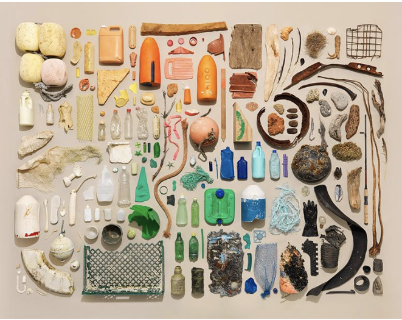

# Collective Intelligences: Blockchain, Web 3.0, & DAOs

This week we learned about blockchain, cryptography, and decentralized autonomous organizations (DAOs) and explored the social and ethical implications of these technologies. Our instructor, Mar Canet, showed us how to create and mint our own NFTs on the Tezos blockchain. For our assignment we were to develop a project during a workshop related to NFTs, web3, or other topics presented in the course.  

I partnered with Sami and we came up with an idea on a web 3.0 marketplace platform for selling handmade and second-hand goods. This idea is in line with our final intervention related to "crafting communities" where we are encouraging clothing reutilization and ucycling at a community level. We recently visited a textile reutilization center in Barcelona and learned that 50% of the clothing donated in this center can't be reutilized and end up in the landfill or incinerated.  Globally only [20% of discarded textiles](https://theroundup.org/textile-waste-statistics/) are collected and of those only a fraction are able to be reutilized.  

  

Through this process some of our initial ideas were:  

- DAO marketplace, co-op for makers/crafters
- Carbon offset credits
  - rewarded to use second hand items 
  - to charge fast fashion companies to purchase textile waste as credits
  - Blockchain to trace to make sure companies aren’t cheating 
- Using photos of the waste– input as a data set to AIi generate images of upcycled designs, to show possible new creations from the waste
  - Alternative of visualizing textile waste 

## Web 3.0 Marketplace Platform for Handmade and Second-hand goods  

*If Etsy, Facebook Marketplace, and Craigslist had a baby with Web 3.0*  

Our first idea is based on a platform like Mastodon or Mighty Networks that gives creative communities a platform to sell their products. We believe that the marketplaces shouldn’t be owned and dominated by just a few corporations. This platform allows artisans, makers, and small business owners to set up their own community based micro-markets based on interests and affinity groups. Each marketplace is governed by its own unique community cooperative. The platform provides a template as a jumping off point for and structure for listing items and collecting payments.  

Within these affinity groups artists can make their own collectives which allows them to share a storefront. This allows for artists starting out or people who want to sell things without having inventory for a whole store to be able to collaborate together with others. With blockchain, the earnings can also be shared securely and quickly among the collectives.  

We mention craigslist because it has stayed true to being a simple and free platform over the years. It also is a platform where users can make what they want of it, and where niche interests and communities can be found. Etsy as a marketplace for handmade goods and vintage finds is also unique in their user base and makes it accessible for anyone to find a specific item.  

For our platform, there are other ideas we would like to incorporate. One would be a place where people could post specific artist or designer needs for a task. This is great as a way to connect artists with customers in a customized and personalized way. It also allows for another stream of revenue for makers. Another idea would be an online flea market where people could stumble or discover artists, makers, and designers as you do when you are walking around a market. This could either be a permanent portion of the platform or designated times of the year.  

Overall we want a platform that supports the makers and artists first. This platform can be a new way to approach the interaction of makers and marketplaces.  

  

## Visualizing Waste Collection

As a separate idea, we are also working on ways to visualize clothing waste in a more impactful way besides just piles of clothing. There is a possibility of incorporating AI in showing potential ways of upcycling or combining clothing as a fun way to show the possibilities of what to make out of clothes.  

Instead of having giant piles of clothing, we think it would be more impactful to show items side by side to show each piece in its entirety. This could also be used as an awareness tool through data visualization.  

*Example image:*
  
*Clothing collected from Andromines, a local waste collection site:*
  

