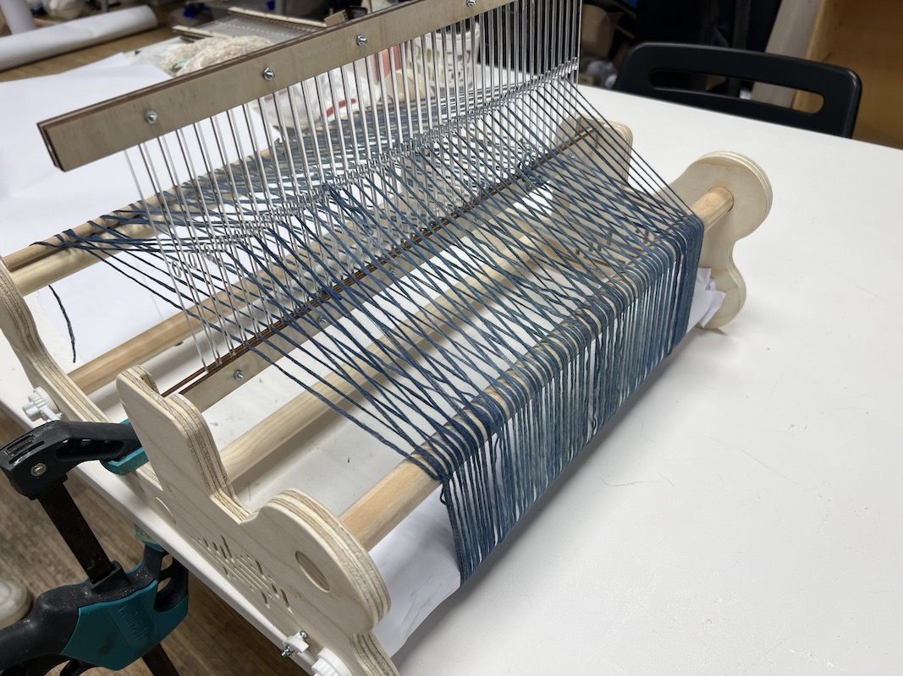

# Design Studio Term 03

## Framing First Design Intervention

After the feedback from Design Dialogues after term two I realized that I want to continue working on this idea of crafting communities. Sam and I want to continue offering opportunities for people to gather around making and focusing on upcycling and reusing things we already have. I want to keep working on the open source tools and see how they can be used to tackle textile waste. I also want to explore how to build a community around craft and regenerative practices in fashion. Here are the first ideas for going forward this term.  

- Host UFO nights (Unfinished Objects) where people are invited to bring projects that have been started but haven’t had time to finish.  
- Host clothing repair workshops where people are invited to bring their own clothes to learn how to repair them by hand.  
- Workshops on using open source tools made in the makerspace and inviting people to participate in “crafts in the lab”
- Host a community dye back where people can bring their old clothes and dye them together to extend the life of the clothes they already own.  
-  Contact clothing recycling centers to find materials to be used in reutilization and upcycling efforts.  

I also want to try and incorporate my learnings from the microbial and other non-human communities to see how it can be applied in organizing crafting communities around a cause or purpose. I am wondering how I can create an environment that invites diversity where I and others flourish. Sami and I got together and made a collective design space for these ideas that we plan to start working on this term. 

Our Initial ideas for the next interventions
  

Our collective design space
  

### Crafting Community: Last Interventions

**UFO Nights**  
In the previous term we started out meeting up regularly with our classmates to do some crafts together in an informal setting and to decompress from the week. We continued them into this term. We started calling these nights U.F.O nights, which stands for unfinished objects. The idea is that everyone brings unfinished craft or diy projects they have sitting around to work on.  

**Craft in the lab**  
As we continued meeting we decided to start using tools and resources in the lab to help do our crafts. We started the crafts in the lab in the previous term and continued them into this term.  
---
- Bacteria Dye
    In the previous term we used the Biolab at the Fab Lab to host a small workshop on bacteria dyeing. We dyed some silk fabrics with the bacteria dye. These dyes are more natural than dyes currently used commercially to dye our clothes, work on both synthetic and natural fibers, and require substantially less water. Dyes like this have the potential to contribute to making clothes in a more sustainable way.  
- Open Source Looms
    To continue using the tools in the lab for our crafts we decided to build some looms. We build two separate open source models. We wanted to be able to create some tools that could be used in upcycling fibers into new clothing. One was a rigid heddle loom built by [Kellie Dunn.](https://kelliead.github.io/index.html). We adapted her model to be used on the CNC machine rather than the laser. While making the loom we found some things to improve on for the next time. We are planning to make these improvements and then send them back to the original creator. The second loom was a more basic loom created by [The Interlace Project](https://www.instructables.com/Laser-Cut-Mini-Frame-Loom-Weaving/). This loom was cut on the laser and we recreated it to be used in weaving and upcycling workshops.  

Bacteria Dye in the Lab
  

Fabric samples dyed with bacteria and natural pigments
  

Loom based on Open Source design by Kellie Dunn
  

#### Visit to Andròmines  
We connected with a friend of a colleague, Kat, and started having a discussion about sustainable fashion, natural fibers, and textile waste. We discussed how globally only [20% of discarded textiles](https://theroundup.org/textile-waste-statistics/) are collected and of those only a fraction are able to be reutilized. As we were discussing ways to collaborate, Kat suggested that we design an exhibition around clothing waste. We wanted a way to visualize the problem and raise awareness about clothing waste.  

We eventually connected with a clothing reutilization center called Andròmines. We visited their reuse warehouse in Montcada i Reixac. At this center they collect and sort clothing donations from approximately 50 collection boxes throughout Spain. They collect approximately 800 kilograms every 15 days. Of all that is collected at Andròmines half of that is able to be reutilized or recycled. The rest, known as 'rebuig' (Catalan for refuse), is incinerated or disposed of. This is due to a number of reasons one being the clothing is made from synthetic blended fibers and can’t be recycled, this includes anything where the label has been cut off rendering it unable to be recycled for fibers. Other reasons clothing cannot be reused are that it is of poor quality, that it is damaged beyond reuse or repair or that it comes from a fast fashion label. The clothing from fast fashion has overwhelmed their recycling center and there is so much that there is little to no value in the clothing in the second-hand market. 

Clothing ready to be sorted at Andròmines sorting center
  

#### Clothing Reutilization as a Personal Practice  

One of the ways to address the issues of clothing waste is to change our personal consumption habits. We are hoping people could start to assess their buying habits more critically and assess how and what their clothing is made from [(Jordi)](https://andromines.net/es/2019/06/13/ropa-comprar-o-reutilizar-una-accion-en-nuestras-manos/).The practice of extending the life of our clothes is a crucial part of crafting a more sustainable future. We still need to hold the textile industry accountable for their use of fossil fuels, fast fashion, and workers rights but we can make a significant difference by extending the life of our clothing items. According to [Greenpeace](https://storage.googleapis.com/planet4-international-stateless/2018/01/6c356f9a-fact-sheet-timeout-for-fast-fashion.pdf), extending the life of a clothing item from 1 year to 2 years can reduce the amount of carbon emissions by 24%. 

I have been following several social media influencers online who are sharing the practice of "upcycling" and "thrift flips" and I have been inspired to do the same. I have been collecting a few items from local second hand shops. On our first visit to Andròmines we identified and collected a few items of clothing that could potentially be reused and upcycled into new clothing items. Our goal with this part is to inspire, influence, and teach others about reutilizing and upcycling clothing. To do this I realized, based on what I learned in previous interventions, that we needed to involve ourselves in this personally by practicing this clothing upcycling ourselves. We have selected and began documenting the process of repurposing these clothing items into clothing we would actually want to wear ourselves. 

Clothing collected from Andròmines refuse bin to be upcycled
 

#### Visualizing the Waste  
> rebuig *m* (Catalan) (*plural* rebuigs or rebutjos) NOUN 
>1. rejection, refusal 
>2. refuse (items or material that have been discarded)

After the first visit to Andròmines we had some new ideas for how to design an exhibition. We decided to schedule a second visit and take photos of each article of clothing in one bin. We could then weigh the bin and use the photos as a visualization of how much clothing waste is discarded from one bin. I think carefully laying each article of clothing out and treating them more personally gives a better connection to the material than leaving them in a pile and treating them like trash.  

70kg of clothing from the refuse bin, unwanted and destined for the landfill. Just under half of the clothing in this bin. 
 

#### Our Blueprint: Crafting Futures Together  

For our final intervention Sami and I will be hosting a workshop to invite people to explore the future of fashion through what we wear. The workshop, Our Blueprint: Crafting Futures Together, is meant to celebrate community, creativity, and sustainability. As a community we will be transforming used clothes into vibrant new pieces through an indigo dyeing workshop. Participants will be invited to bring their own clothes, and we also have some items collected from Andromines. At the event we will also present the open source looms as tools people can build themselves to transform old clothing and use to create their own fashion. Lastly we will lead a collaborative discussion on natural fibers featuring our collaborator, Kat, an industry expert on natural fibers in the textile industry. Our aim with a workshop like this is to teach and empower people to create and transform their own clothes, shaping a more sustainable future together. We believe that encouraging making clothes together is better than the current methods of designing and making clothes. 

Final Intervention Event Planning
  

Final Intervention Poster

## Alternative presents to Emergent Futures  

In the previous term Sami and I envisioned an alternative present where people are empowered to create things themselves rather than relying on an exploitative system. We want to create a space where people can slow down and make together, combating isolation, perfectionism, and honoring traditional methods of making. With our final intervention, *Our Blueprint: Crafting Futures Together,* the aim is to teach and empower people to create and transform their own clothes, shaping a more sustainable future together. The present fashion system exploits people and causes massive destruction to the planet. The current role of the designer in the fashion system is top down – the designer works with corporations to determine and dictate what people wear around the world. I would like to see a change where we move toward a model where everyone participates more directly in expressing themselves through what they wear. The role of the designer can be to facilitate this self expression of others through education and guiding people to have the skills they need to express themselves. The designer can also serve as a connector - connecting the broken parts of the fashion systems that can transform it into something that is less exploitative and works for more people. We believe that making together as a community has the power to start making this vision a reality.  

In this intervention we want to invite people to explore this idea of “Future Heirlooms”. We are asking what sort of clothing items would people like to pass on to future generations. Currently we are adding immense amounts of clothing to landfills that will be there for generations to come. These are the things we are currently giving to future generations. We want to spark a discussion about how we can change that by creating, crafting, and loving our clothes. We want to know what such a future would look like to other people. I believe that taking a role as a facilitator in discussions around the future and including everyone is the type of role I can have as a designer, allowing others to design and shape the future through what they wear.  

