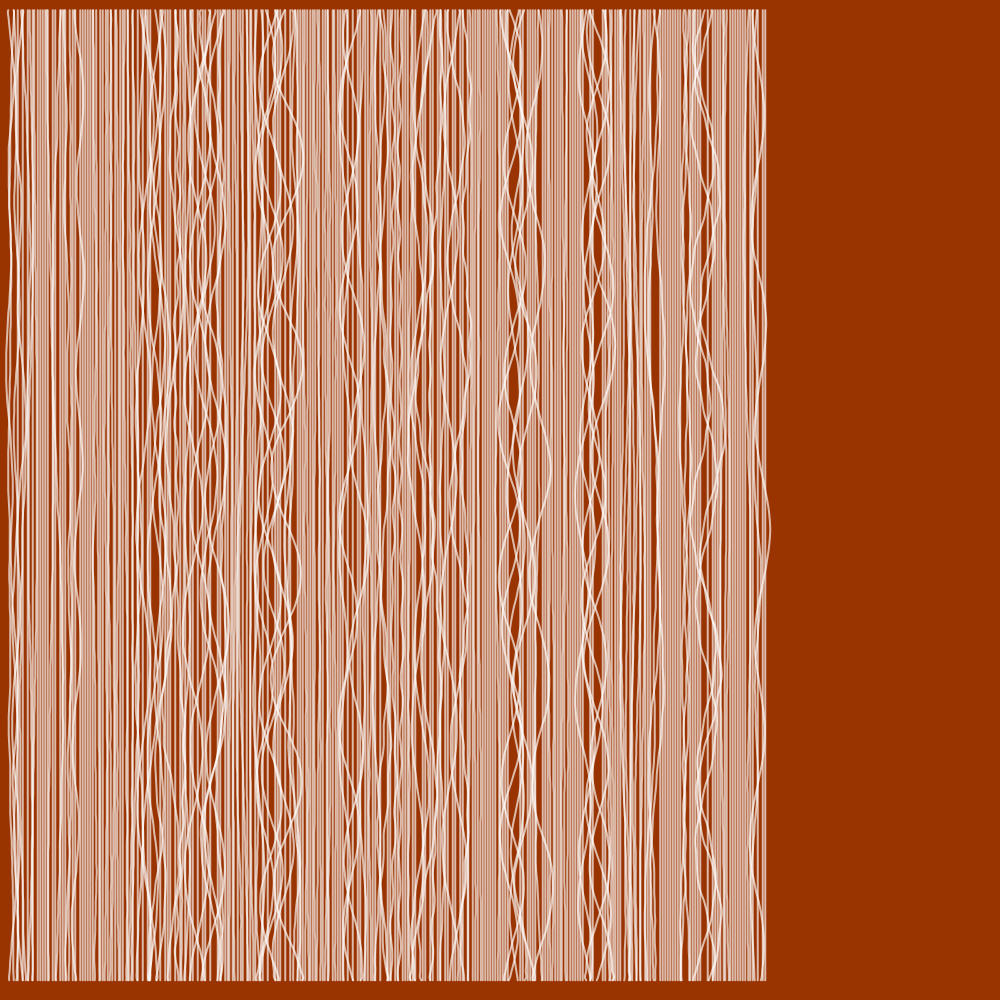
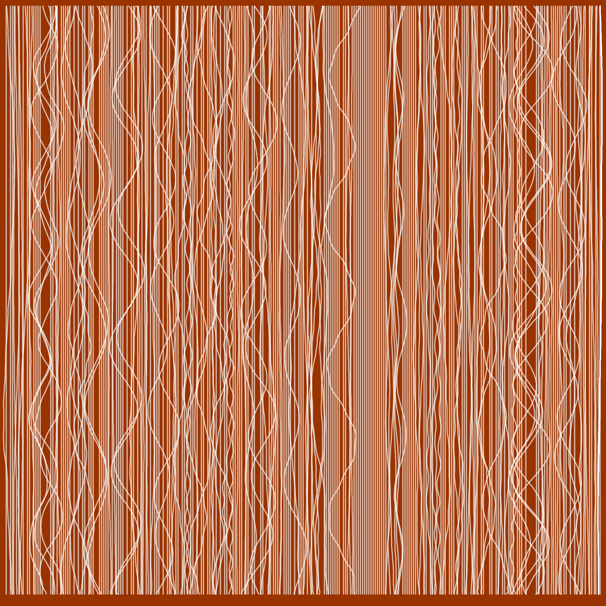
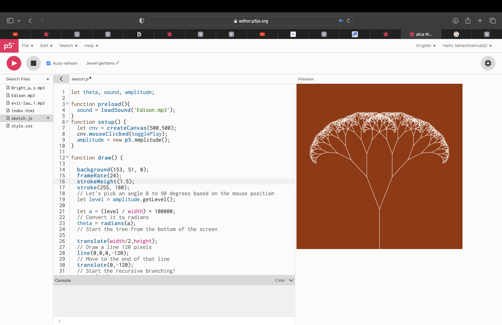
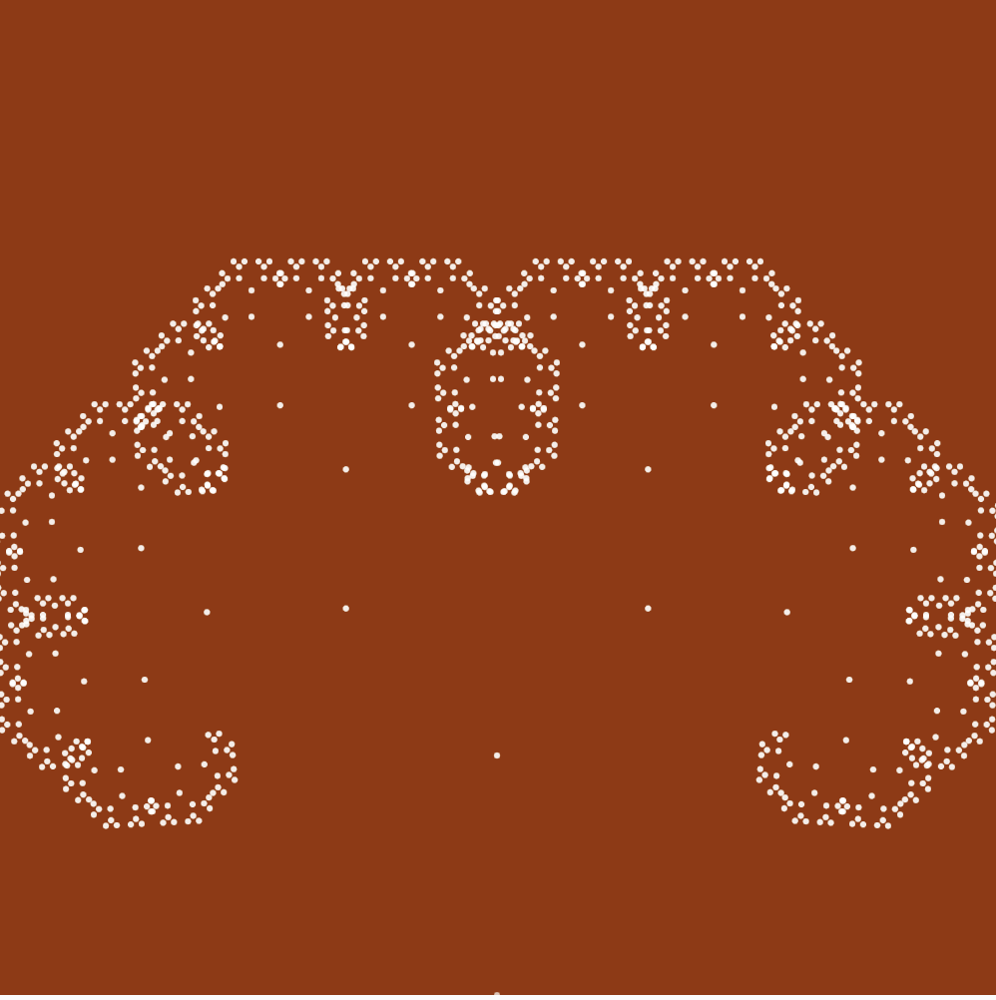
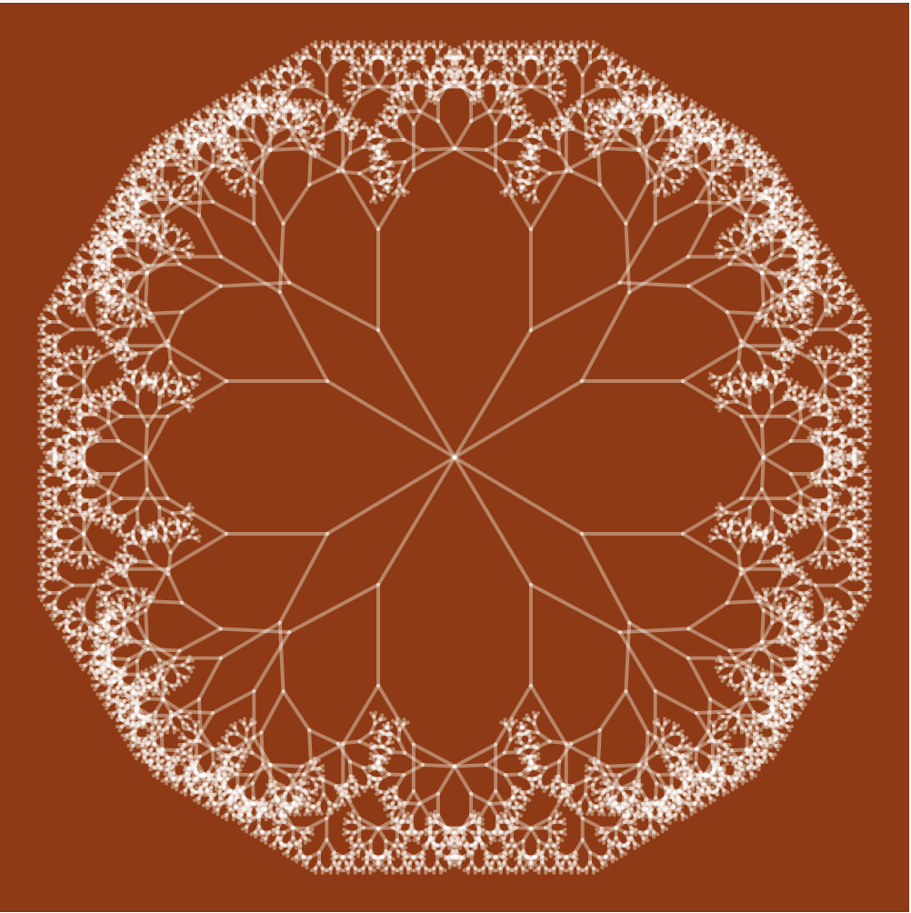

# Digital Prototyping for Design: Interfaces

## Wildcard - Robots  

For this class we got to learn how to control a robotic arm with Grasshopper and simulate the movements in Rhino. Josep demonstrated on how to install the library for the robotic arm and how to use a Grasshopper example sketch to get the robot to "write letters". I was able to install it on my computer and try out the simulation. It was pretty easy to install and get started moving the robot arm in the Rhino/Grasshopper simulation. I made a simulation in Grasshopper of the robotic arm saying "Hi Robot". 

  

In the lab Josep attached an LED to the robot so the robot could do "light writing". Using a timelapse camera we were able to capture the LED light tracing based on the robot's movements to get some cool light art. This was really fun and I was surprised how easy it was to control this robot even though it looks very complicated.  

  

  

## Advanced Design tools - Blender  

In this course Victor introduced us to Blender and gave us an in depth look into the company and ways we could use the software. Going into this class I only thought of Blender as a 3D modeling program but after this I realized that it can be used to do so many things. One of the things I actually found very interesting was the history of Blender as a company. We learned about how they use an open source GNU GPL license that allows users to use Blender for free for any purpose, distribute freely, study how it works, and distribute changed versions with an obligation to publish those changes to keep it free and open. This free and open source model has kept Blender sustained since 1994. This is refreshing to me coming from an American perspective because in the business world I never heard much support for open source types of intellectual property and related business models. Blender has been able to sustain themselves for nearly 30 years as a non-profit due to their devoted community. The users own the software fully and new features developed are available to everyone. Over the years they have developed the platform to include tools for 3D modeling, sculpting, animation, UV mapping, rendering, and video editing.  

It always amazes me what people can build when we don't have to worry about profits. I have heard people argue that making intellectual property closed, patentable, etc allows for more innovation. Blender is a great example on how open software and community can build amazing things without the need for profits. Ultimately the biggest takeaway for me this week was the open and free business model. I will definitely be revisiting that part of it in the future if I am thinking about business models.  

## Live Coding as a Human Interface  

In our course, we had the privilege of listening to Citlali Hernandez's captivating presentation on interaction design, electronics, and embodiment. I was genuinely thrilled to hear about her work, as it resonated strongly with my own interests. One aspect that particularly fascinated me was her journey in designing wearables for performers. Initially, Citlali didn't wear the creations herself, but she soon realized the value of testing them personally and actively participating in the performances. This shift significantly impacted her work. Similarly, I have been involved in designing wearables for performers, but I have not explored the personal aspect of wearing and testing them. Inspired by Citlali's experience, I now feel compelled to engage more intimately with the process of creating these wearables in the future. Although I have been hesitant to express myself as a performer in the past, I am now more open to exploring this avenue.

Following the presentation, Citlali introduced us to the world of Live Coding, a captivating practice where individuals program visualizations and music on the fly, often as part of live performances. She shared insights about the local and international communities of artists who have formed around these events, primarily focused on electronic music. In class, we had the opportunity to experiment with a platform called Hydra, developed by Olivia Jack. [Hydra](https://hydra.ojack.xyz/) is a live coding video synth that enables users to create animations directly in the browser. It provides seamless integration of audio and video inputs and outputs, and its user-friendly interface makes it accessible for beginners. Participating in this class was an absolute delight, and it exposed me to an entirely new universe of video animation tools, communities, and practices that I had never known existed.  

  

## Blender as Interface

## Final Micro-challenge: Intellectual Property  

For this final challenge Seher and I continued working on the project we had been working on in previous microchallenges. Our project, Andaaza, was created to encode audio messages onto the surface of everyday objects -- a ceramic cup is what we have started with. Andaaza was created as a storytelling tool to carry our messages through time and to explore alternative ideas of measurement from a post-scientific perspective. In the past two challenges we successfully built a machine that takes audio input in real time, processes it, and embosses it onto a ceramic cup, similar to how sound can be recorded onto a vinyl record.

Check out the full project on our [GitHub](https://github.com/SeherKrishna02/Andaaza)

### Audio Generated Visuals  

To incorporate what we learned this term in our digital prototyping courses we decided to add a digital component to accompany the project. We planned to create a collection of digital assets based off the sound recordings that will be taken at the time of creating the cups. These digital twins will accompany each ceramic cup and stay on a digital archive online to represent the messages engraved in each cup.  The sound waves will be recorded in both the cups and into an audio file.

#### Processing  

We started working on making generative images from the sound recordings in Processing. We generated some still images based off the sound waves that we thought matched the aesthetics and feeling of the project. These images were generated with the audio recordings in Processing using the minm library based on this paper by [Manuel Kretzer](http://responsivedesign.de/wp-content/uploads/2016/05/tutorial-06_processing-soundmapping2.pdf). 

  

  

#### p5.js   

After creating these images we realized that we would like the media to be more interactive and decided to try out the sound recordings in a more interactive format with p5.js. p5.js will allow us to make interactive graphics that can be embedded as javascript on a webpage.  Here are the sample visualizations made in p5.js to accompany the sound recordings.

[Mother's Kitchen](https://editor.p5js.org/agjarv/full/4PX7xMz5z)  
[Grandmother's Kitchen](https://editor.p5js.org/agjarv/full/qOPdnXOsH)  
[My Kitchen](https://editor.p5js.org/agjarv/full/o7EYgK_W5R) 

[Edit Code](https://editor.p5js.org/agjarv/sketches/o7EYgK_W5R)

  
  
  

### Online Archive

We decided to create a webpage to host our archive of interactive media. The website can be found here: https://seherkrishna02.github.io/Andaaza/

Going further we would like to make a version of the p5.js sketch we created so that visitors to our webpage can interact and add to the archive. We got this feedback in our final presentation and we would like to incorporate it. This sketch will allow visitors to respond to the question "What message would you like to pass on to future generations?" They will be able to record and save audio and then modify select parameters of the sketch to customize the visual appearance of the animation. This sketch will be embedded in our archival webpage so that people can contribute to the archive even if they can't participate in the live intervention. 