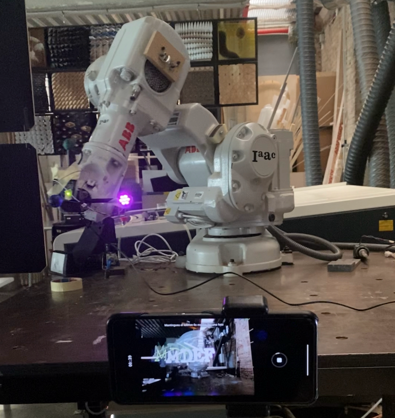
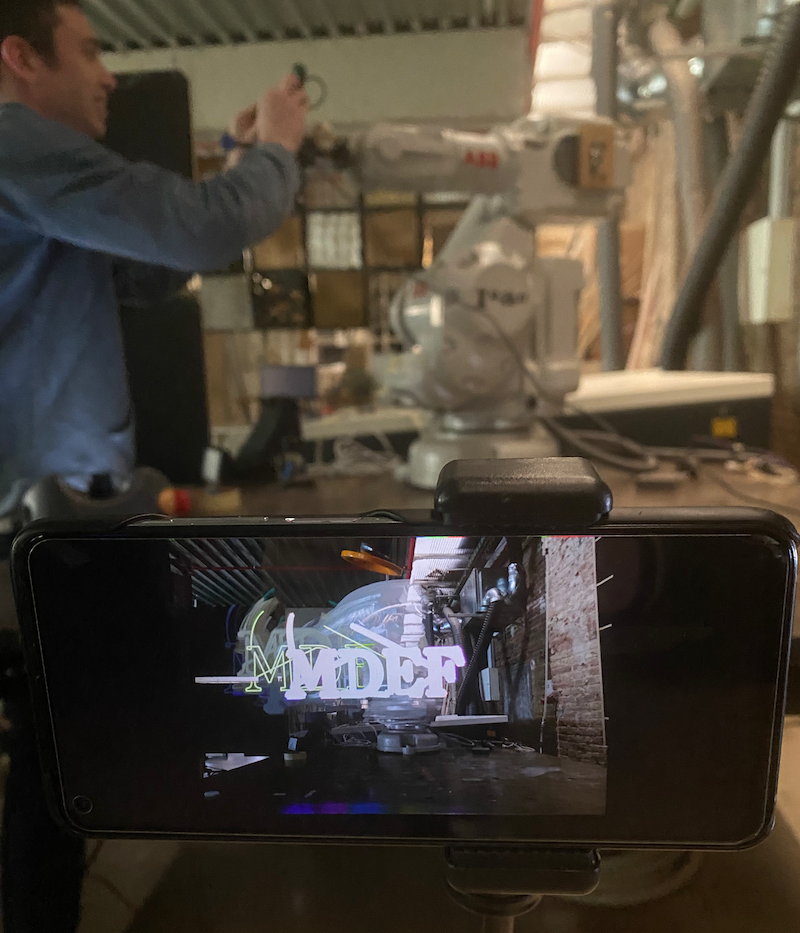

# Digital Prototyping for Design: Interfaces

## Wildcard - Robots

For this class we got to learn how to control a robotic arm with Grasshopper and simulate the movements in Rhino. Josep demonstrated on how to install the library for the robotic arm and how to use a Grasshopper example sketch to get the robot to "write letters". I was able to install it on my computer and try out the simulation. It was pretty easy to install and get started moving the robot arm in the Rhino/Grasshopper simulation. I made a simulation in Grasshopper of the robotic arm saying "Hi Robot". 

  

In the lab Josep attached an LED to the robot so the robot could do "light writing". Using a timelapse camera we were able to capture the LED light tracing based on the robot's movements to get some cool light art. This was really fun and I was surprised how easy it was to control this robot even though it looks very complicated.  

  

  

## Advanced Design tools - Blender

## Live Coding as a Human Interface

## Blender as Interface

## Final Micro-challenge: Intellectual property

For this final challenge Seher and I continued working on the project we had been working on in previous microchallenges. Our project, Andaaza, was created to encode audio messages onto the surface of everyday objects -- a ceramic cup is what we have started with. Andaaza was created as a storytelling tool to carry our messages through time and to explore alternative ideas of measurement from a post-scientific perspective. In the past two challenges we successfully built a machine that takes audio input in real time, processes it, and embosses it onto a ceramic cup, similar to how sound can be recorded onto a vinyl record.

Check out the full project on our [GitHub](https://github.com/SeherKrishna02/Andaaza)

To incorporate what we learned this term in our digital prototyping courses we decided to add a digital component to accompany the project. 